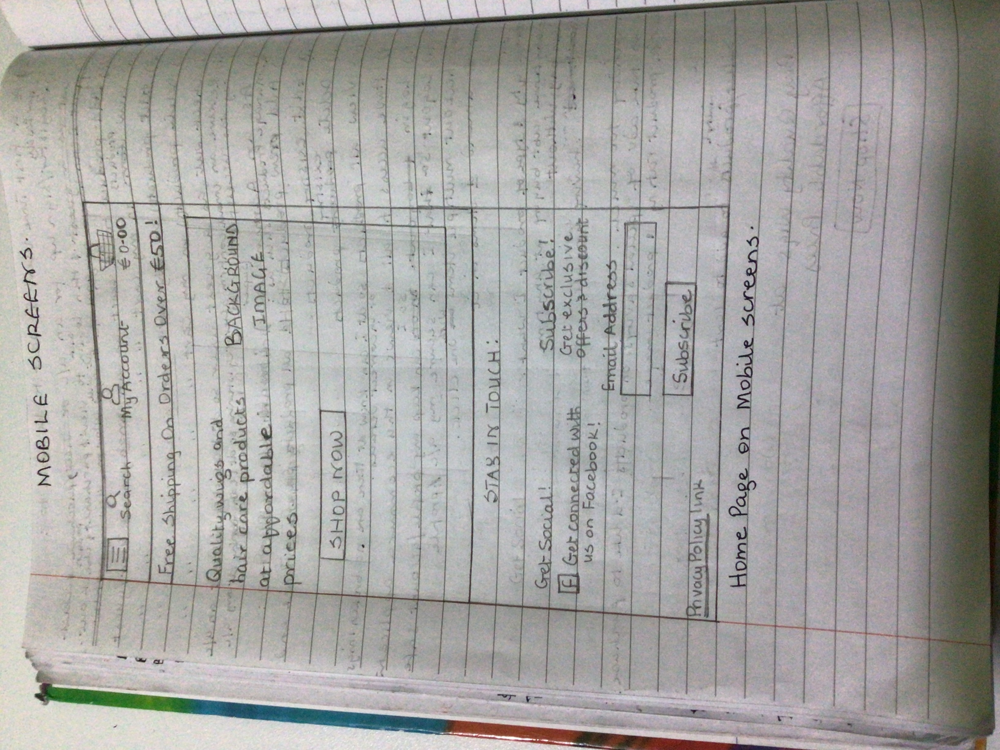
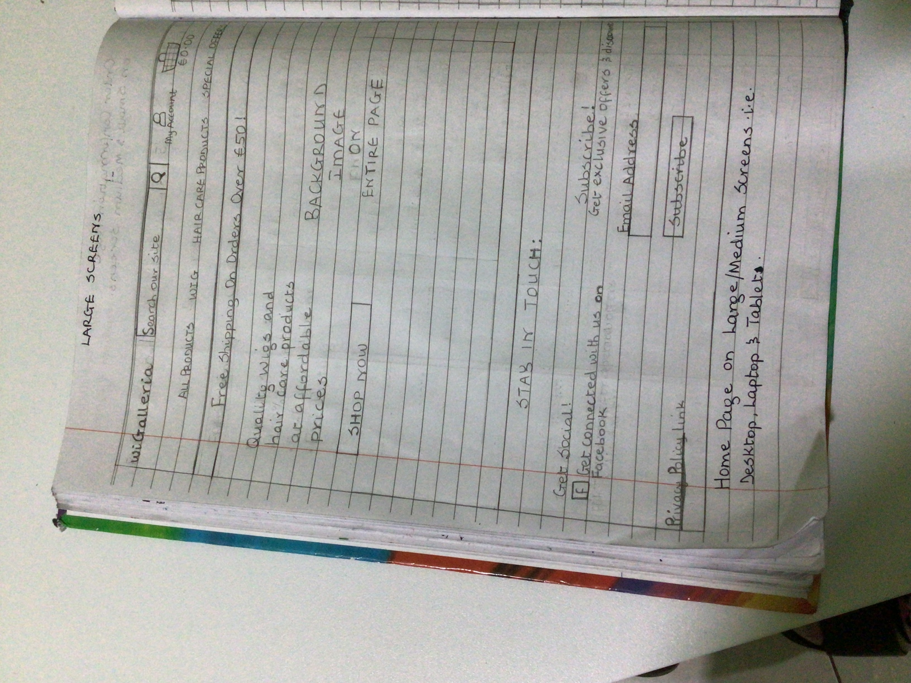
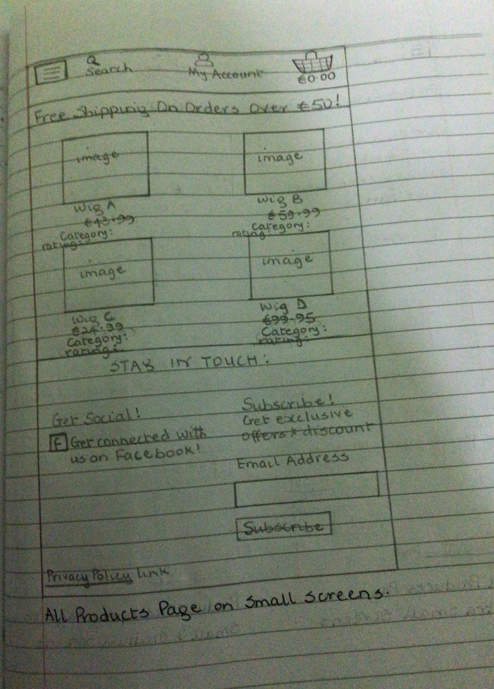
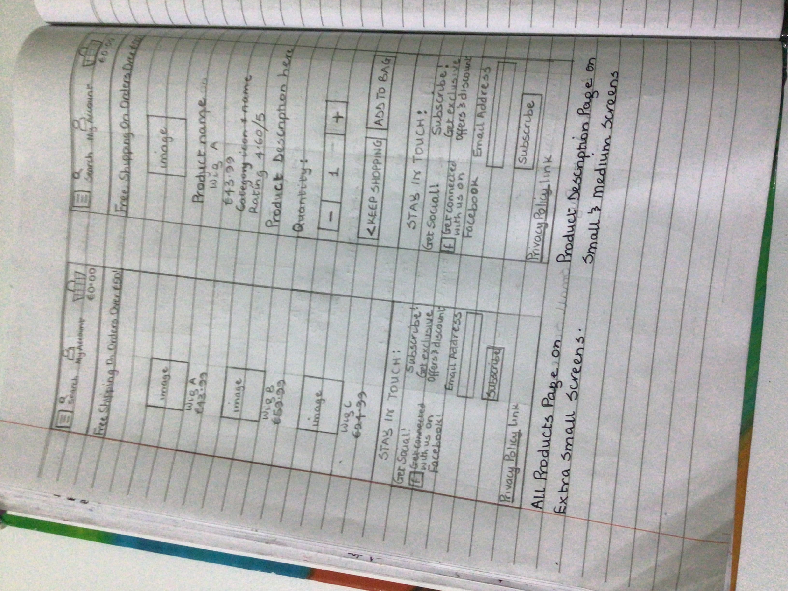
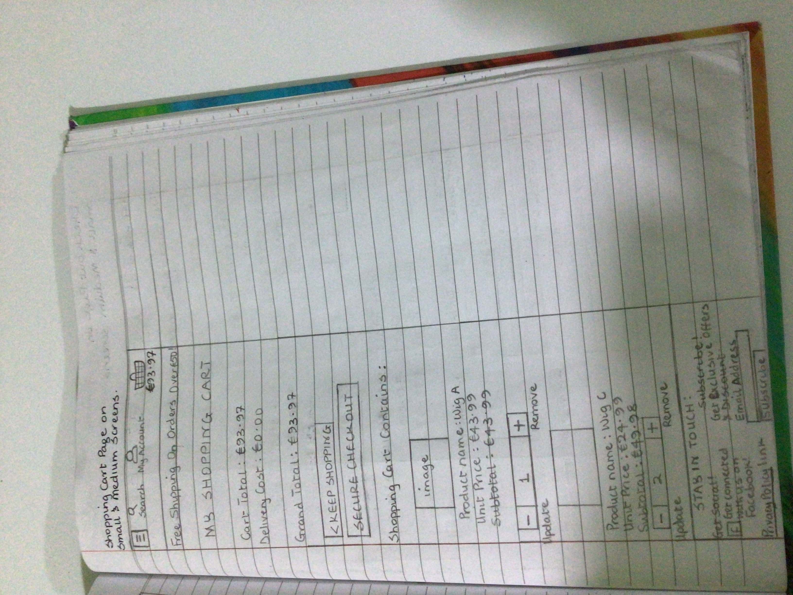
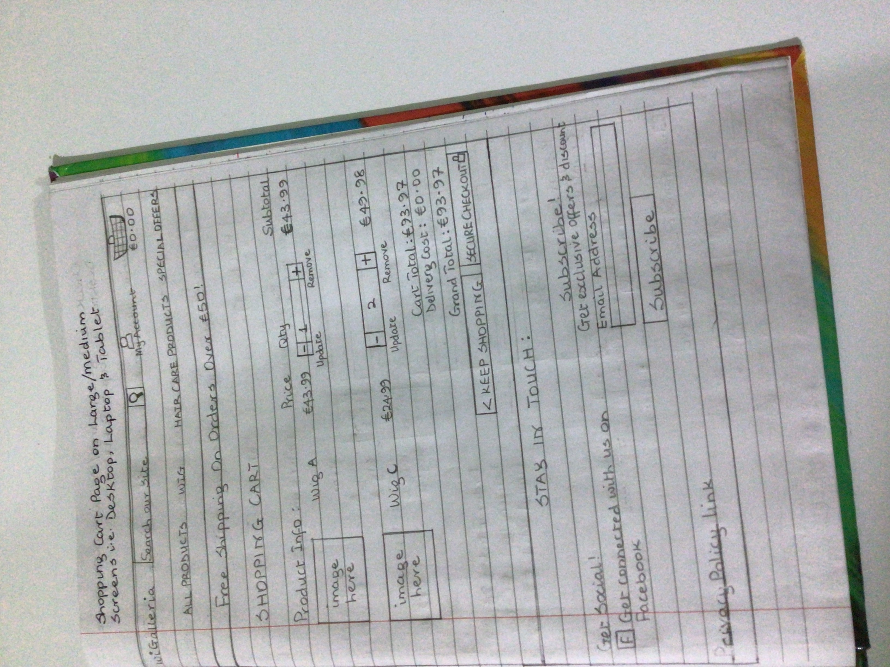
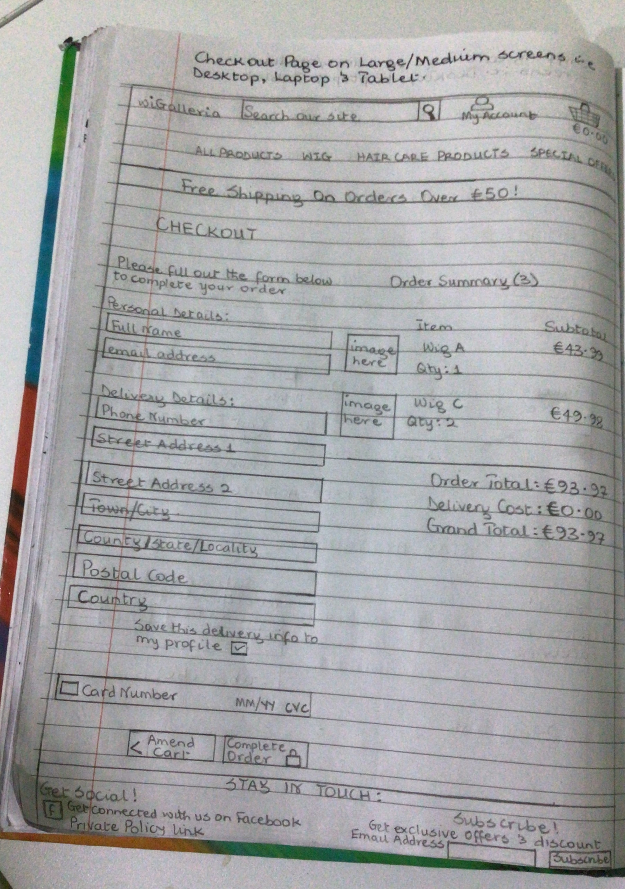
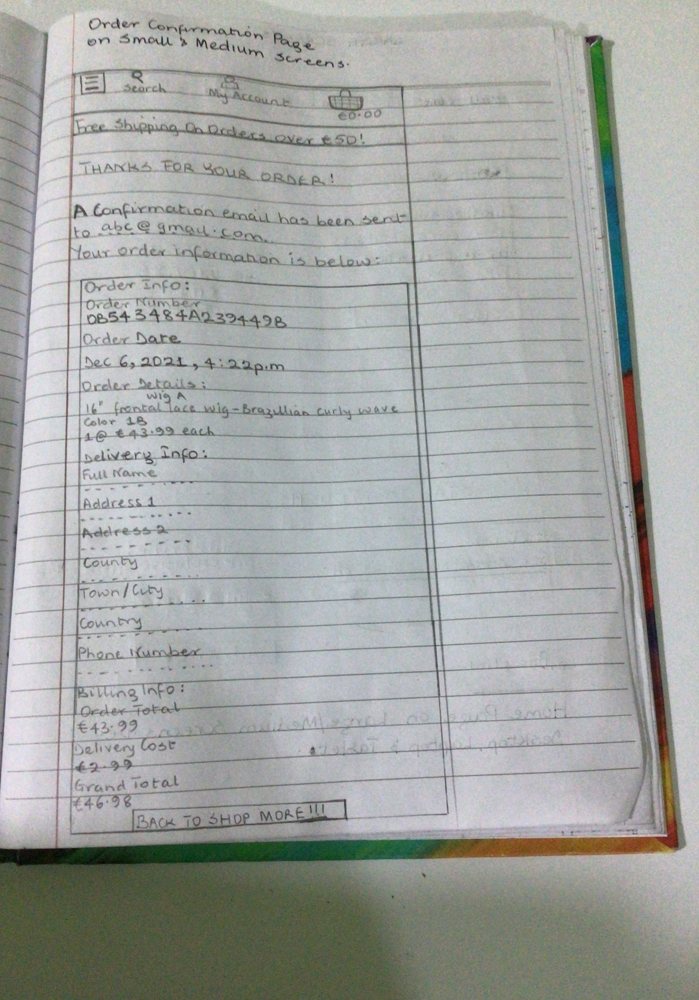
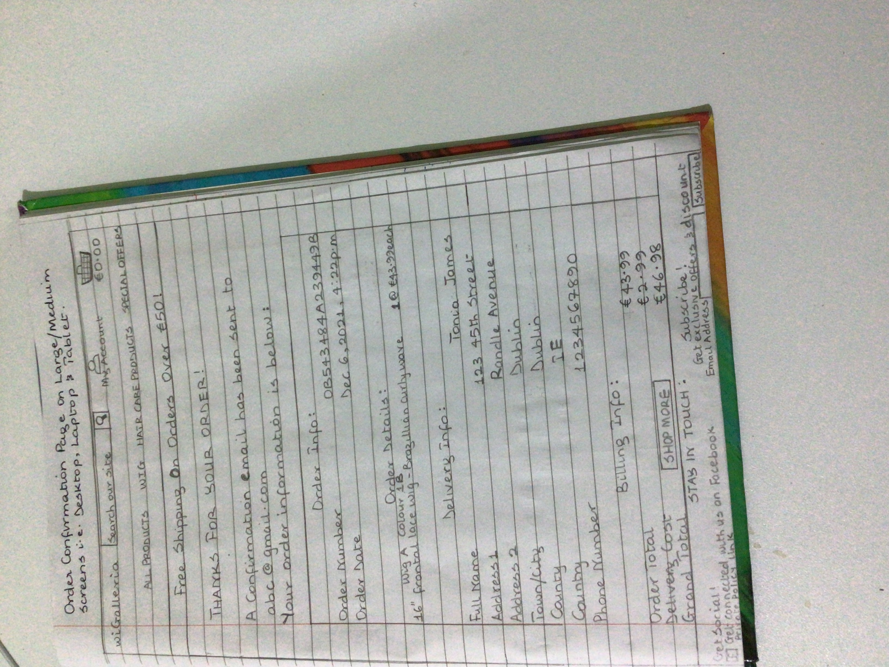

# wiGalleria E-commerce Wig Store

wiGalleria is an e-commerce wig store app dedicated for the main purpose of purchasing wigs of different colours, shapes and textures as well as hair care products that helps wigs last longer.
This project was created using Python based Django framework. It is a fully featured app similar to real e-commerce apps out there that we use everyday with payment gateway that allows a user make payment but as this is a prototype, users are informed not to use their real debit/credit cards to purchase but can only use test debit/credit card provided by Stripe whose details will be given to anyone who wants to test this out once it's finished. A user will be able to perform full CRUD functionality i.e Create, Read, Update and Delete his data as well as making payment through the use of Stripe gateway API. The programming languages used for the development of this app are a combination of HTML, CSS (both bootstrap & custom) & JavaScript for the front-end and Python based Django framework for the back-end development. 

The purpose of this app is to allow a user purchase wigs and hair care products online in the comfort of their own homes without physically going to the store. Having an online wig store  eliminates the shortfall of store closing as it is on 24/7 except when store maintenance is taking place. The beauty and biggest advantage of building an ecommerce wig store is that it opens up a manually handled local business to a wider reach/audience worldwide so that it can be accessible for anyone to purchase wigs and hair care products from any location. 

The user interacts with the app through the GUI interface i.e front-end templates designed for each functionality such as add & edit products in the cart, view or delete products in the cart, view all products in the store & select the one(s) to purchase. There are role-based authentication system in place that ensures that different users can access different views i.e only registered/login/admin users can access certain views. An admin user will be the only one allowed to manage the store by interacting with the app through the front-end GUI interface & Django backend i.e perform CRUD functionality of Create, Read, Update & Delete products.  This store is protected with a very strong authentication system so that no unauthorised person will have access to its content. 

# Features

This E-commerce app named wiGalleria will allow the user register for an account, login, logout, checkout either as a registered user or guest user if they don't want to sign up for an account. It will also give them the ability to add product(s) to, edit or delete product(s) from and view products in the shopping cart.
When a user checks out, it will calculate and display the delivery cost as well as the total cost of products purchased before they make payment. It shows the user a summary of their order while on the checkout page and allows them to edit/update quantity of products they've selected earlier if they change their minds about buying them.
Overall, though the app is a prototype at the moment, yet it is a full fledge e-commerce app except that real purchase & payments cannot be made until some little adjustments are made and hopefully, this will be augmented in the near future to reflect this.

# Existing Features

The wiGalleria app will provide the following features to its users: 

* Create: It will allow a registered or guest user to add product(s) into the shopping cart 
* Read: It will allow a registered or guest user to view the items in their shopping cart
* Update: It will allow a registered or guest user to edit items in their shopping cart 
* Delete: It will allow a registered or guest user to either remove one or all products from their shopping cart
* Sign Up: It will allow a guest user to register for an account if he doesn't have one yet before he can access some features of the app
* Login: It will allow a user to authenticate i.e log in if he already has an account in 
order to be able to access some features of the app.
* Logout: It will allow a user to log out of his account in order to secure his profile/personal information from unauthorised users
* It has a feature that saves a user's delivery info in his profile if he opts in using the check box provided for a faster checkout any time he visits the store again. 
* If a user is logged in while purchasing product(s) and his delivery details has been saved the first time he made an order, during checkout, the delivery details which has been saved already in the user's profile info will be pre-filled in the delivery details section in order to check out faster 
* It will allow a non-registered or not logged in user to purchase products and checkout as a guest user

---

User Experience (UX)

* User stories

First Time User Goals

a) As a First Time User, I want to easily understand the main purpose of the site and the app to be intuitive so I can navigate through the site easily without any ambiguity. 

b) As a First Time User, I want to be able to register/sign up for an account in order to have a personal account that will allow me view my profile.  

c) As a First Time User, I want to be able to access information through their social media links to see their followings on social media to determine how trusted and known the app is.

Registered User Goals

a) As a Registered User who is logged in, I want to be able to save my shipping details so that I can check out faster anytime I shop again.

b) As a Registered User who is logged in, I want to be able to have a personalised user profile so that I can view my personalised order history, order confirmation and save my payment information. 

c) As a Registered User, I want to be able to log in to my account so that I can access my personal account information.

d) As a Registered User who is logged in, I want to be able to log out of my account so that my account can be safe from unauthorised access.

---

Registered & Guest User Goals

a) As a Registered, First time or Returning Guest User, I want to be able to easily see the image, name, price, rating & category of the product I want to buy in order to know that I'm buying the right product at the price I can afford.

b) As a Registered, First time or Returning Guest User, I want to be able to quickly identify deals, clearance items and special offers in order to take advantage of special savings on products I'd like to purchase.

c) As a Registered, First time or Returning Guest User, I want to be able to easily view the total of my purchase at any time so that I can avoid spending too much.

d) As a Registered, First time or Returning Guest User, I want to be able to view all available products in order to select some for purchase.

e) As a Registered, First time or Returning Guest User, I want to be able to easily check out in order to purchase products without logging in or setting up an account.

f) As a Registered, First time or Returning Guest User, I want to be able to easily delete product(s) in the cart in order to have the choice to remove it if not needed anymore.

g) As a Registered, First time or Returning Guest User, I want to be able to edit products in the cart in order to adjust it any time if I change my mind.

h) As a Registered, First time or Returning Guest User, I want to be able to view products in the cart in order to know what I'm purchasing.

i) As a Registered, First time or Returning Guest User, I want to be able to add product/products to the cart in order to purchase a single one or check out multiple items in one click.

j) As a Registered, First time or Returning Guest User, I want to be able to access information through their social media links to see their followings on social media to determine how trusted and known the app is.

---

Admin User Goals

a) As an Admin User, I want to be able to log into my account in order to have the authorised access to manage products in the database.

b) As an Admin User, I want to be able to log out of my account in order to protect it from unauthorised access.

c) As an Admin User, I want to be able to manage products within the store i.e create, read, update & delete products into/from the database so that users of the website can enjoy a good user experience when interacting with the site.

---

# Design

* Colour Scheme

* Typography

The Roboto font is the main font used throughout the whole website with Sans Serif as the fallback font in case for any reason the font isn't being imported into the site correctly. Roboto is  

* Imagery
Imagery is important. There is a background image used in this app for the home page.

---

# Wireframes

For prototyping, the wireframes were designed manually by hand without using any automated tool in order to bring this idea to life. See screenshots below:

Home/Landing Page for Mobile Screen sizes:

Home/Landing Page for Medium & Large Screen sizes:

All Products Page for Small Screen sizes: 

All Products Page for Medium & Large Screen sizes: 

All Products Page for Extra Small Screen sizes,
Product Description Page for Small & Medium Screen sizes: 

Shopping Cart Page for Small Screen sizes: 

Shopping Cart Page for Medium & Large Screen sizes: 

Checkout Page for Small & Medium Screen sizes: 

Checkout Page for Large Screen sizes: 

Order Confirmation Page for Small Screen sizes: 

Order Confirmation Page for Medium & Large Screen sizes: 

---

Agile Approach Used

* I used a [kanban board on GitHub](https://github.com/Eb0nY-April14/wigalleria_v1/projects/1) as the agile planning tool for my Django app. A project was created in GitHub with issues and milestones set. I also used the MoSCoW labelling technique to prioritise my user stories into Must-Have, Should-Have, Could-Have and Won't-Have. At the start, I put all my user stories in the "To do" section of the board, then I moved the Must-Haves into the "In progress" section and once I finished working on a functionality and everything responds as I want, I then move it to the "Done" section.

---

# Database Schema

This e-commerce store is made up of different apps each with its own model and the database schema below is used to show/describe how these models interact with each other i.e the relationship that exists between objects within the said models. This relationship can either be one to one, one to many or many to many relationship but in this project, they are all one to many.

* View the database Schema below: 

---