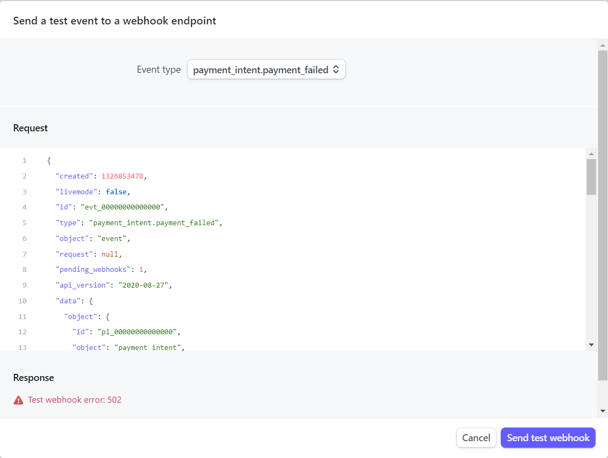
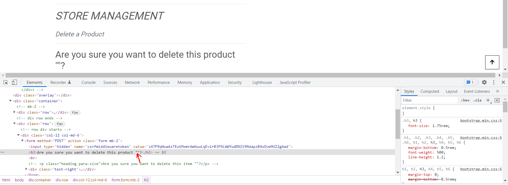
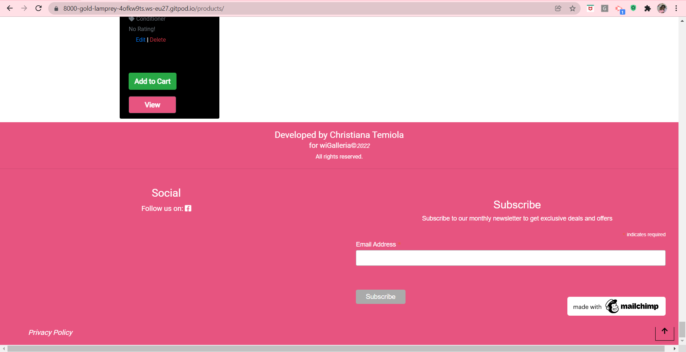
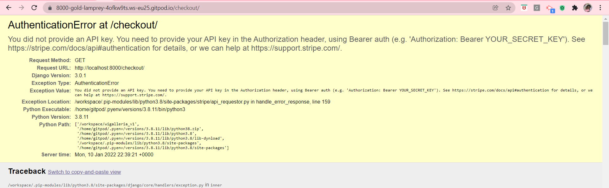
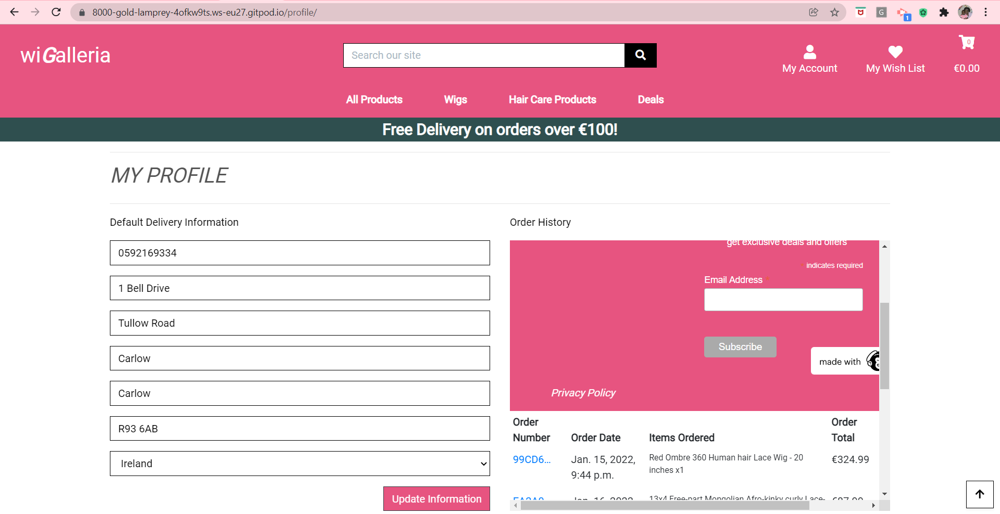
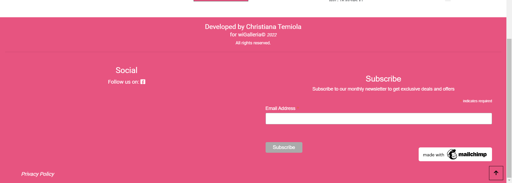
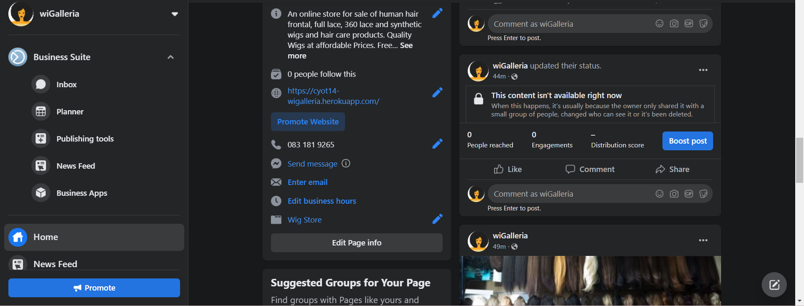

# wiGalleria E-commerce Wig Store

wiGalleria is an e-commerce wig store app dedicated for the main purpose of purchasing wigs of different colours, shapes and textures as well as hair care products that helps wigs last longer.
This project was created using Python based Django framework. It is a fully featured app similar to real e-commerce apps out there that we use everyday with payment gateway that allows a user make payment but as this is a prototype, users are informed not to use their real debit/credit cards to purchase but can only use test debit/credit card provided by Stripe whose details will be given to anyone who wants to test this out once it's finished. A user will be able to perform full CRUD functionality i.e Create, Read, Update and Delete his data as well as making payment through the use of Stripe gateway API. The programming languages used for the development of this app are a combination of HTML, CSS (both bootstrap & custom) & JavaScript for the front-end and Python based Django framework for the back-end development. 

The purpose of this app is to allow a user purchase wigs and hair care products online in the comfort of their own homes without physically going to the store. Having an online wig store  eliminates the shortfall of store closing as it is on 24/7 except when store maintenance is taking place. The beauty and biggest advantage of building an ecommerce wig store is that it opens up a manually handled local business to a wider reach/audience worldwide so that it can be accessible for anyone to purchase wigs and hair care products from any location. 

The user interacts with the app through the GUI interface i.e front-end templates designed for each functionality such as add & edit products in the cart, view or delete products in the cart, view all products in the store & select the one(s) to purchase. There are role-based authentication system in place that ensures that different users can access different views i.e only registered/login/admin users can access certain views. An admin user will be the only one allowed to manage the store by interacting with the app through the front-end GUI interface & Django backend i.e perform CRUD functionality of Create, Read, Update & Delete products.  This store is protected with a very strong authentication system so that no unauthorised person will have access to its content. 


# Features

This E-commerce app named wiGalleria will allow the user register for an account, login, logout, checkout either as a registered user or guest user if they don't want to sign up for an account. It will also give them the ability to add product(s) to, edit or delete product(s) from and view products in the shopping cart.
When a user checks out, it will calculate and display the delivery cost as well as the total cost of products purchased before they make payment. It shows the user a summary of their order while on the checkout page and allows them to edit/update quantity of products they've selected earlier if they change their minds about buying them.
Overall, though the app is a prototype at the moment, yet it is a full fledge e-commerce app except that real purchase & payments cannot be made until some little adjustments are made and hopefully, this will be augmented in the near future to reflect this.

# Existing Features

The wiGalleria app will provide the following features to its users: 

* Create: It will allow a registered or guest user to add product(s) into the shopping cart 
* Read: It will allow a registered or guest user to view the items in their shopping cart
* Update: It will allow a registered or guest user to update the quantity of product(s) in their shopping cart 
* Delete: It will allow a registered or guest user to either remove one or all products from their shopping cart
* Sign Up: It will allow a guest user to register for an account if he doesn't have one yet before he can access some features of the app
* Login: It will allow a user to authenticate i.e log in if he already has an account in 
order to be able to access some features of the app.
* Logout: It will allow a user to log out of his account in order to secure his profile/personal information from unauthorised users
* It has a feature that saves a user's delivery info in his profile if he opts in using the check box provided for a faster checkout any time he visits the store again. 
* If a user is logged in while purchasing product(s) and his delivery details has been saved the first time he made an order, during checkout, the delivery details which has been saved already in the user's profile info will be pre-filled in the delivery details section in order to check out faster 
* It will allow a non-registered or not logged in user to purchase products and checkout as a guest user
* It allows a role-based authentication i.e only an admin user has all full permission including add, update and delete products from the back end (i.e database).

---

User Experience (UX)

* User stories

First Time User Goals

a) As a First Time User, I want to be able to easily understand the main purpose of the site and the app to be intuitive so I can navigate through the site easily without any ambiguity. 

First Time or Guest User Goals

a) As a First Time or Guest User, I want to be able to register/sign up for an account in order to have a personal account that will allow me view my profile.  

b) As a First Time or Guest User, I want to be able to receive confirmation email after registration/signing up for an account

Registered User Goals

a) As a Registered User who is logged in, I want to be able to save my shipping details so that when I'm logged in, I can check out faster anytime I shop again.

b) As a Registered User who is logged in, I want to be able to have a personalised user profile when I'm logged in so that I can view my personalised order history, order confirmation and save my payment information. 

c) As a Registered User who is logged in, I want to be able to add general/specific comments relating to a product so that I can convey any general or specific issue I have with the ordering of the product to the seller

d) As a Registered User who is logged in, I want to be able to review a product so that I can give feedback to the seller on his product

e) As a registered user who is logged in I want to be able to like/unlike a product so that I can spot it easily when I want to buy it later/again or mark it down if it wasn't as described by the seller after purchase

f) As a Registered User who is logged in, I want to be able to log out of my account so that my account can be safe from unauthorised access.

g) As a Registered User who is logged in, I want to be able to add product to my wishlist so that I can easily find them for purchase later.

h) As a Registered User who is logged in, I want to be able to remove product from my wishlist so that I can free up space to add more products.

i) As a Registered User who is logged in, I want to be able to view products in my wishlist so that I can be reminded of the product I want to buy later.

j) As a Registered User, I want to be able to log in to my account so that I can access my personal account information.

k) As a Registered User, I want to be able to access information through their social media links to see their followings on social media to determine how trusted and known the app is.

---

First Time, Registered or Guest User Goals

a) As a First Time, Registered or Guest User, I want to be able to easily see the image, name, price, rating & category of the product I want to buy in order to know that I'm buying the right product at the price I can afford.

b) As a First Time, Registered or Guest User, I want to be able to quickly identify deals, clearance items and special offers in order to take advantage of special savings on products I'd like to purchase.

c) As a First Time, Registered or Guest User, I want to be able to easily view the total of my purchase at any time so that I can avoid spending too much.

d) As a Registered, First time or Guest User, I want to be able to view all available products in order to select some for purchase.

e) As a First time, Registered or Guest User, I want to be able to easily check out anonymously in order to purchase products without logging in or setting up an account.

f) As a First time, Registered or Guest User, I want to be able to easily delete product(s) in the cart in order to have the choice to remove it if not needed anymore.

g) As a First time, Registered or Guest User, I want to be able to update products in the cart in order to adjust it any time if I change my mind.

h) As a First time, Registered or Guest User, I want to be able to view products in the cart in order to know what I'm purchasing.

i) As a First time, Registered or Guest User, I want to be able to add product/products to the cart in order to purchase a single one or check out multiple items in one click.

j) As a First time, Registered or Guest User, I want to be able to access information through their social media links to see their followings on social media to determine how trusted and known the app is. 

k) As a First time, Registered or Guest User, I want to be able to view a list of products so that I can select some to purchase

l) As a First time, Registered or Guest User, I want to be able to receive an email confirmation after checking out so that I can keep the confirmation of what I've purchased for my records.

m) As a First time, Registered or Guest User, I want to be able to view my order confirmation after checkout so that I can verify that I haven't made any mistakes while placing the order.

n) As a First time, Registered or Guest User, I want to be able to easily enter my payment information so that I can check out quickly with no hassles.

o) As a First time, Registered or Guest User, I want to be able to update the quantity of individual item in my cart so that I can easily make changes to my purchase before checkout.
Answer in TESTING.md: A user can update the quantity of products already selected in her shopping bag before checking out by selecting the right quantity using quantity selector box and click on the update link provided underneath.

p) As a First time, Registered or Guest User, I want to be able to easily select a product's quantity during purchase so that I can guard against accidentally selecting the wrong quantity.
Answer in TESTING.md: Each product detail page has its own quantity selector box to avoid selecting the wrong quantity

q) As a First time, Registered or Guest User, I want to be able to view a specific category of products so that I can quickly find products I'm interested in without having to search through all products.
Answer in TESTING.md: A user can use the search input box provided at the main nav section of the page to display the products with the category she's interested in and filter out other categories.

r) As a First time, Registered or Guest User, I want to be able to view individual product detail so that I can see detailed information about its description, like, review or leave a comment.

---

Admin User Goals

a) As an Admin User, I want to be able to log into my account in order to have the authorised access to manage products in the database.

b) As an Admin User, I want to be able to log out of my account in order to protect it from unauthorised access.

c) As an Admin User, I want to be able to manage products within the store i.e create/add, read/view, update/edit & delete products into/from the database so that users of the website can enjoy a good user experience when interacting with the site.

---

# Design

* Colour Scheme

The two main colours used in this app are Pink and White in order to get a good contrast, enhance usability and make users enjoy a great User experience. The choice of pink is borne out of the fact that since it's a girly website that deals with wigs & wigcare products and pink is loved by most women, I decided to go for this with a contrast of white for the font colour. The background colour used for the navigation bar and footer sections is Pink with font colour of white for the texts while for the content area, the home page has a background image while the rest of the pages have a background colour of white with font colour of black.

* Typography

The Roboto font is the main font used throughout the whole website with Sans Serif as the fallback font in case for any reason the Roboto font isn't being imported into the site correctly. The Roboto typeface is elegant and renders well on high-resolution screens such as Android phones and as such, it’s a perfect fit for many applications.  

* Imagery

The major image in this app is the one used as background image for the home page. The products and product detail pages also have images but those are must haves since it's an e-commerce site that sells physical products that must be displayed for users to see and choose. The logo used for this app is not an image logo but rather, the name of the app/site is used as the logo and if clicked, takes the user back to the home page.

---

# Wireframes

For prototyping, the wireframes were designed manually by hand without using any automated tool in order to bring this idea to life. See screenshots below:

Home/Landing Page for Mobile Screen sizes:


Home/Landing Page for Medium & Large Screen sizes:


All Products Page for Small Screen sizes: 


All Products Page for Medium & Large Screen sizes: 


All Products Page for Extra Small Screen sizes,
Product Description Page for Small & Medium Screen sizes: 


Shopping Cart Page for Small Screen sizes: 


Shopping Cart Page for Medium & Large Screen sizes: 


Checkout Page for Small & Medium Screen sizes: 


Checkout Page for Large Screen sizes: 


Order Confirmation Page for Small Screen sizes: 


Order Confirmation Page for Medium & Large Screen sizes: 


---

Agile Approach Used

* The agile planning tool used for my Django app is the Kanban board. I used the board on GitHub for the planning of my wiGalleria e-commerce site project. Three boards are created to represent the 3 iteration phases used to plan this project. 
Each project was created with issues and milestones set. I also used the MoSCoW labelling technique to prioritise my user stories into Must-Have, Should-Have, Could-Have and Won't-Have. At the start, all the user stories are put in the "To do" section of each board, then the Must-Haves are moved into the "In progress" section and once a functionality is completed and everything responds as expected, it's moved to the "Done" section.
The links to these 3 boards are given below:

[kanban board 1 on GitHub](https://github.com/Eb0nY-April14/wigalleria_v1/projects/1)

[kanban board 2 on GitHub](https://github.com/Eb0nY-April14/wigalleria_v1/projects/2)

[kanban board 3 on GitHub](https://github.com/Eb0nY-April14/wigalleria_v1/projects/3)

---

# Database Schema

This e-commerce store is made up of different apps each with its own model and the database schema below is used to show/describe how these models interact with each other i.e the relationship that exists between objects within the said models. This relationship can either be one to one, one to many or many to many relationship but in this project, they are all one to many.

* View the database Schema below: 


---

# Technologies Used

* Languages Used

* HTML, CSS and JavaScript for front-end development

* Python for backend development

---

Frameworks, Libraries and Programs Used

1. Git

* Git was used for version control by utilising the Gitpod terminal to commit to Git and push to GitHub.

See Git link [here](https://git-scm.com/)

2. GitHub

* GitHub was used to store the project's code after being pushed from Git.

See GitHub link [here](https://github.com/)

3. Bootstrap 4.1 & Custom CSS

* Bootstrap 4.1 and custom made CSS files were used to assist with the responsiveness and styling of the website.

See Bootstrap 4 link [here](https://getbootstrap.com/docs/4.1/getting-started/introduction/)

4. Django & Jinja templating Language

* The entire project anchors on this framework as it was used to build this app.

See Django link [here](https://www.djangoproject.com/)

5. Amazon S3 Bucket

* S3 Bucket was used to host static and media files that will be needed for storing products images, background image and CSS files. Since Heroku can't serve static and media files on its own but works seamlessly with amazon S3 bucket, an aws account has to be created and S3 bucket created within it so that all static and media files can be uploaded there and it can serve all the static files on Heroku as it works well with it.

See Amazon AWS link [here](https://aws.amazon.com/)

6. Stripe Payment

* Stripe is a Payment infrastructure for the Internet. Their software and APIs were used in this project to accept test payments for our wigalleria e-commerce site.

See Stripe Payment link [here](https://stripe.com/en-ie)

7. Roboto Google Font:

* They were used on all pages throughout the project.

See Roboto Google Font link [here](https://fonts.google.com/specimen/Roboto)

8. Font Awesome Icons:

* Font Awesome was used to add social media, shopping cart and all other icons across all pages throughout the app for excellent UX. 

See Font Awesome link [here](https://fontawesome.com/)

9. jQuery:

* jQuery came with Bootstrap to make the navbar responsive.

See JQuery link [here](https://jquery.com/)

10. Windows 10 built-in Photo Editor:

* This was used to resize the logo used on all page across the app.     

---

# Issues Encountered and Resolved

* There were some issues experienced with the products page after deployment to Heroku. 12 of the products were missing but visible on the development side. I went to the media folder of the aws bucket created for wiGalleria to check if the products names there corresponds to the ones in the media folder on gitpod workspace and discovered that I gave the wrong extension to some i.e .jpg instead of .png, some had name mismatch and as soon as I corrected those, most of the images showed up leaving 2 products missing. I then went to the database through Django admin and re-entered the names of those 2 products checking that they match the ones in aws bucket, then add, commit & push them to GitHub, refreshed the Heroku deployed site and all products images were displayed correctly. See screenshots below:


* The stripe webhook failed when I sent a test event to a webhook endpoint. It gave an error message of "Test webhook error: 502" and after thorough checking, two causes were discovered which are:
* The empty variables placeholders I left in the env.py file were preventing Stripe from seeing the stripe keys in there. They were left there in case more environment variables need to be added to my env.py file but I didn't realise quickly enough that this was the root cause that prevents Stripe from seeing the stripe keys in env.py files. 
* Secondly, I placed the env.py in the wrong location i.e in the wigalleria app instead of the root directory. I fixed these issues by commenting the environment variables placeholders out and moving the env.py file to the root directory, then ran the webhook test again & received a successful message this time, it worked. See screenshots below:




* When an admin user wants to carry out a delete product opertion, there is a confirmation message displayed to him to confirm if he actually wants to delete that product or cancel the delete and return to home. It should specifically mention the name of that product to be deleted so the user can make a choice if to go ahead with the deletion or cancel it but when I tested this feature on completion, it displayed the message quite alright but didn't render the product's name but left it blank. It was discovered that the issue with this was that in my delete_product function view views.py, I didn't render the product got by the get_object() function in a context so the context had no name of product to render so it displayed an empty quotes (i.e "") but onec I added the product variable name into the context, the issue was solved. See screenshots of before and after below:





* Also, I had an issue with the products delete view for an admin user. I included a message that allows an admin user to confirm deletion or cancel before the actual deletion takes place. This was put in place to avoid deletion by mistake but when it was run in the browser, it threw an error with the message "delete view template does not exist". This was due to the fact that I omitted "products/" that should precede the delete_product.html template name in my path name when I was rendering it. According to my file path, the delete_product.html template resides inside the products folder so that should be specifed as "products ---> templates ---> products" directory but as soon as that was corrected, the template rendered appropriately. See screenshot of error message and its solution below:


* An issue erupted during the Heroku deployment. Since the rule is that after connecting to Postgres, we must run migrations again using the commands "showmigrations" & "migrate" afterwards. I ran the showmigrations successfully but when I put in the terminal the "migrate" command, it threw an error that says "AssertionError: database connection isn't set to UTC". I then googled for this issue to find the cause & possible solutions to this sort of error and found a very helpful resource on stackoverflow which explained that this issue was caused as a result of a recent update to version 2.9 of psycopg2 as explained in this GitHub issue: 
[GitHub Link to resolve database UTC Issue](https://github.com/psycopg/psycopg2/issues/1293#issuecomment-862835147)

* The solution given to this problem on stackoverflow is to downgrade psycopg2 (or psycopg2-binary if you are using the stand-alone package) below 2.9 (e.g. psycopg2>=2.8,<2.9) in your requirements file e.g downgrade to 2.8.6 using: pip3 install psycopg2==2.8.6
I did that and the issue was resolved. 
The link to the solution on stackoverflow is below:
[stackoverflow Link to resolve database UTC Issue](https://stackoverflow.com/questions/68024060/assertionerror-database-connection-isnt-set-to-utc)

* After creating the footer code in my base.html template and viewed it in the browser, I found out that it didn't display at the right location. It was joined together with the navbar section at the top of each page instead of the bottom. I tried playing around with the chunk of the footer code by moving it from one section to the other to see if that would resolve the issue but it didn't so I had to contact Code Institute tutor support for help. It was there that the tutor pointed my attention to where I placed the footer, immediately after the closing head tag and ignoring the block content code there. In the tutor's words: 
"The main content and the header is actually below the footer, please look at line starting 181 - 185 in base.html, I believe that should be moved to line 147". I followed his instruction, viewed my code in the browser and found out that the footer has rightly moved to the bottom across all pages. See screenshots below:




* Another issue was encountered during the implementation of Stripe payment for my project. I created the payment intent in my checkout views.py but when I opened it in the browser to check it out, it broke my checkout page giving an error that says "Authenticationerror at checkout. You did not provide an API key. You need to provide your API key in the Authorization header, using Bearer auth (e.g. 'Authorization: Bearer YOUR_SECRET_KEY')". I tried to solve this issue but was unable to so I contacted tutor support and after much troubleshooting, she noticed that 'env.py' file is not being read correctly in settings.py. On a closer look by the tutor and her colleague, it was discovered that the error was caused as a result of the empty variables set with no name and values in env.py file. Commenting out all these empty variables in env.py file solved the issue and the code ran successfully.
See screenshots below:



* An issue was encountered on the profile page. Instead of the footer being displayed at the bottom of the page, it showed up at the order history section to the right of the default delivery information while the order history was pushed underneath it. Initially, I used the dev tools to inspect to see if I could resolve it but couldn't so I went to tutor support but no one was available until tomorrow so I went back to take a proper look again and discovered that there were some unclosed tags on the page. One table and div tags were unclosed so I closed them, refreshed the page in the browser and everything took the right shape again. See screenshots below:

Profile Page Issue:



Profile Page Issue Fixed:




---

# Web Marketing

* Out of all the web marketing strategies available for marketing e-commerce sites, Facebook was chosen to market this wiGalleria website because it has a wider reach to target customers and is also a social media platform mostly used by ladies/women. Since wiGalleria is an online wig store, it feels appropriate to target our customers through this social media platform. The Facebook page called wiGalleria has been created with the necessary information such as link to deployed site on Heroku, physical address/location of the business, phone number and shop now button provided to customers. The link to wiGalleria Facebook page is provided below:

[wiGalleria Facebook Page Link](https://www.facebook.com/wiGalleria-110791034831427/) 

Also, the screenshots of my wiGalleria Facebook Page are below:





---

# Testing

To view all testing documentation, click to view the [TESTING.md](TESTING.md) file.

---

# Deployment

## Local Deployment

* In order to make a local copy of this project, you can clone it. In your IDE Terminal, type the following command to clone my repository:

- `git clone https://github.com/Eb0nY-April14/wigalleria_v1.git`

* Alternatively, if using Gitpod, you can click below to create your own workspace using this repository.

[](https://gitpod.io/#https://github.com/Eb0nY-April14/wigalleria_v1)

## Steps to setting up Amazon S3 Bucket

i) Navigate to aws.amazon.com and click on "create an aws account"

ii) Fill in your email and password details, then choose a username for your account and select "continue"

iii) It will request for your credit card details  and a couple more verification questions. Your account will then be created once all these are confirmed.

iv) Go back to aws.amazon.com and click on the "sign in to console" button locted at the top right corner of the page.

v) Click on the radio button that has "Root User" beside it to select it and click "Next"

vi) Type the characters displayed into the input text box provided for security check and click the submit button. You will then be signed in if correct and the dashboard displayed to you.

vii) Since you are a first time user, S3 will not be available in your "recently accessed services" but can be found by searching for it in the "Find Services" section of the AWS Management Console. Once found, click on it and another page will be displayed on which you will create your bucket.

viii) To create a bucket that is needed to store your files in, click on the "Create bucket" button.

ix) Give your bucket any name of your choice but to keep with constitency, it's advised to give it same name to match your Heroku app's name

x) For the region, select the one closest to your location

xi) Since this bucket needs to be public in order to allow public access to our static files,uncheck the "Block all public access" box and acknowledge that the bucket will be public by clicking the acknowledgement check box provided.

xii) Click on the "Create bucket" button to create the bucket.

xiii) On the left hand side of the page, click on "Buckets" and it will display all the buckets that have been created. If you are a new user, only one bucket will show up.

xiv) Look for your newly created bucket by name if there are many buckets available and click on it.

xv) Set a few basic settings on your new bucket by clicking on the "Properties" tab and turn on "Static website hosting" by clicking on the 'edit' button beside it.

xvi) Click on the "Enable" radio button to select it.

xvii) Under the Hosting type section, the "Host a static website" option has been auto-selected already so leave it that way

xviii) For the index and error document, fill in some default values e.g index.html and error.html since they won't be used for anything in this setup, then click on the "save changes" button.

xix) Click on the "Permissions" tab to make 3 changes. Firstly, under the 'CORS configuration' click on the 'edit' button, copy this code below and paste it into the textarea input provided:

```
[
    {
        "AllowedHeaders": [
            "Authorization"
        ],
        "AllowedMethods": [
            "GET"
        ],
        "AllowedOrigins": [
            "*"
        ],
        "ExposeHeaders": []
    }
]
``` 
Then click on the 'Save changes' button. This CORS configuration is going to set up the required access between your Heroku app and S3 bucket

xx) Scroll down the page to the 'Bucket policy' section, click on the 'Edit' button and then on 'Policy generator' button in order to create a security policy for this bucket. The type of policy is 'S3 Bucket Policy'. Allow all Principal by using a * i.e type * into the input box beside Principal and under the 'Actions' heading, select 'GetObject'

xxi) Copy the ARN (stands for Amazon resource name) from the 'Bucket Policy' section in the previous tab and paste it into the ARN box at the bottom.

xxii) Click on the 'Add statement' and 'Generate Policy' buttons respectively.

xxiii) Copy the displayed policy (i.e JSON document) into the bucket policy editor in the other tab.

xxiv) Before clicking on save, since all resources will be allowed access to this bucket, add a 
/* (i.e slash asterisk) onto the end of the 'Resource' key and click on save. Then the bucket policy and and CORS configuration will allow full access to all resources in this bucket.

xxv) Lastly, under the 'Permissions' tab, scroll down to locate the 'Access Control List' (ACL) and click on the 'Edit' button beside it. Under the 'Everyone (public access), click beside the List to check that box, then click the checkbox beside the consent terms and click on 'Save changes' button. The purpose of setting this list objects permission for Everyone is so that everyone can access the objects in this bucket.

## Steps to setting up Identity Access Management (IAM)

xxvi) After creating S3 bucket, you will need to create a user to access it.This will be done through another service called IAM. In the management console, close the amazon S3 tab and type 'IAM' in the 'service' textbox provided, once it's displayed, click on it.

xxvii) Here is to briefly summarise what this process of creating the IAM service entails before breaking it further into steps. First, create a group for your user to live in, then create an access policy giving the group access to the S3 bucket we created earlier and finally, assign the user to the group so that it can use the policy to access all your files. The detailed steps to carry out in order to create IAM are as follows:

a) On the IAM dashboard located at the left hand side of the page, under 'Access management', click on 'User groups' and then on the 'Create group' button located at the top right side of the page.

b) Give your group a meaningful name of your choosing but for consistency, you can use 'manage-<followed by the name of your app>' e.g manage-wigalleria.

c) Create the policy used to access your bucket by clicking on 'Policies' at the left side of the page and then click on 'Create Policy' button at the top right side of the page.

d) Click on the JSON tab and then select 'import managed policy' located on the right hand side of the page. This will allow you import the policy that AWS has pre-built for full access to S3. Type S3 into the search bar to search for it and then import the 'AmazonS3FullAccess' policy and click on the 'Import' button at the bottom of the page.

e) Get the bucket ARN from the bucket policy page in S3. Click on 'Services', select S3 and then 'Buckets' and click on your bucket's name. Click on the 'Permissions' tab, then scroll down to 'Bucket Policy' section. Click on 'Edit' button  and copy the 'ARN', then go back to the IAM service. Under the 'Dashboard' and under the 'Access Management' heading, click on 
'Policies ---> Create Policy ---> JSON' tab and under the 'Resource', put an opening and closing square brackets to denote that a list is going to be put in it and then paste in the ARN copied from S3 bucket with a quotation mark on each item in the list e.g
"Resource": [
    "arn:aws:s3::::type-your-project-name-here",
    "arn:aws:s3::::type-your-project-name-here/*"
]
The first item in the list above is the bucket itself while the other one that has /* at its end adds another rule for all files/folders in the bucket.

f) Click on 'Next:Tags' and then on 'Next:Review' buttons one after the other.

g) On the 'Create Policy' page, give it a name and description under their respective headings. The name you give should match you app name and have a '-policy' attached at the end of it for consistency but not mandatory for example:
Name: cyot14-wigalleria-policy
Description: Access to S3 bucket for wigalleria static files
Then click on 'Create Policy' button and this takes you back to the policy page where you can see that your policy has been created.

h) Attach the policy to the groupcreated earlier by clicking on 'User groups' and then on your policy name i.e manage-wigalleria. Go to 'permissions' tab and then click on the drop down button beside the 'Add Permissions' button and select 'Attach policies'. In the search box provided, type in your policy name and once it shows up, click on the checkbox beside it to select it, then scroll down and click on the 'Add permissions' button.

i) Create a user to put in the group by going to the left hand side of the page, click on 'Users' and at the top right hand side of the page, click on the 'Add users' button. Give it a user name of '<Type the name of your app here>-staticfiles-user' in the space provided to keep up with naming consistency and give the user 'Programmatic access' by clicking on the checkbox beside it, then select the 'Next:Permissions' button.

j) Put the user in the group you created earlier which as you can see, has the policy attached to it already. Just click in the checkbox provided beside it to select it and then click on 'Next:Tags' first and then 'Next:Review' buttons and lastly, click on 'Create User' button.

k) Download the csv file named 'Download.csv' which contains this user's access key and secret access key which will be used to authenticate them from the Django app. Please note that it's very important to download and save this csv file because it can't be downloaded again once you've gone through this process.

## Steps to connect Django to S3

l) Install 2 new packages using the folloeing commands one after the other:
pip3 install boto3 and press the enter key
pip3 install django-storages and press the enter key

m) Freeze them into your requirements.txt file using this command below so they get installed on Heroku when you deploy:
pip3 freeze > requirements.txt and press the enter key

n) Add 'storages' to the already INSTALLED APPS in settings.py file since Django will need to know about it and save it.

o) To connect Django to S3, you have to add some more settings to your settings.py file to tell it which bucket it should be communicating with. this will be done only on Heroku and not on local development side so add an if statement to check if there's an environment variable called 'USE_AWS' in the environment as shown below:
```
if 'USE_AWS' in os.environ:
    # Bucket Config
    AWS_STORAGE_BUCKET_NAME = 'cyot14-wigalleria'
    AWS_S3_REGION_NAME = 'eu-west-1'
    AWS_ACCESS_KEY_ID = os.environ.get('AWS_ACCESS_KEY_ID')
    AWS_SECRET_ACCESS_KEY = os.environ.get('AWS_SECRET_ACCESS_KEY')
    AWS_S3_CUSTOM_DOMAIN = f'{AWS_STORAGE_BUCKET_NAME}.s3.amazonaws.com'
```
* Note that it is very vital to keep these 2 keys above i.e AWS_ACCESS_KEY_ID and AWS_SECRET_ACCESS_KEY secret or else could be used by someone else if it ends up in version control and you'll be billed for it.

p) Go to Heroku settings and add your AWS keys to the config variables by doing the following:
Click on 'Settings tab ---> Reveal Config Vars button and in the input textbox provided with a placeholder of 'KEY', type 'AWS_ACCESS_KEY_ID' into it and in another input textbox provided with a placeholder of 'VALUE', go to the 'Download.csv' file downloaded earlier to get its value, copy and paste it into the input textbox provided and then click on the 'Add' button beside it. 
Repeat this steps for the 'AWS_SECRET_ACCESS_KEY' by copying its value from the downloaded csv file and pasting it into the input textbox provided with a placeholder of 'VALUE', then click the 'Add' button beside it. Also, add the 'USE_AWS' into the input textbox provided with a placeholder of 'KEY' and in the 'VALUE' placeholder input textbox, set it to 'True' so that your settings.py file knows it has to use the AWS configuration when it's deployed to Heroku.

q) Remove the 'DISABLE_COLLECTSTATIC' variable since Django will now collect static files automatically and upload them to S3 once you deploy to Heroku this time around.

r) Back in your settings.py file, tell Django where the static files are coming from in production. This will be from a combination of your bucket name and some amazon names i.e bucketname.s3.amazonaws.com and will be formatted as an f string so that your bucket name will be interpreted and added to generate the appropriate URL as shown in this example below:
AWS_S3_CUSTOM_DOMAIN = f'{AWS_STORAGE_BUCKET_NAME}.s3.amazonaws.com'

s) Next is to tell Django that whenever someone runs collectstatic in production, it should use S3 to store static files and that any uploaded product images should go there too. To do that, create a new file called 'custom_storages.py in your project's root directory.

t) Go to settings.py and under the if statement you created earlier for USE_AWS, tell it that for static file storage, it should use the storage class just created and the location it should save static files to is a folder called 'static'. Do same for media files by using the default file storage and media files location settings. Also, override and explicitly set the URLs for static and media files using your custom domain and the new locations. Save your file.

u) Go to S3 on amazon website and you'll see that there is now a static folder in your bucket will all your static files in it.
All these steps above take care of your static files to get it working so you now have to handle your media files as well.

* To get your media files working, take the following steps:

a) In settings.py file, add an optional setting called 'AWS_S3_OBJECT_PARAMETERS'. This tells the browser that it's ok to cache static files for a long time since they don't change very often, this will improve performance for your users. This should be added on the next line after the 'MEDIA_ROOT' part and save it.

b) Commit these changes by doing the normal git add, commit and push in order to push your code to GitHub so it can be deployed to Heroku.

c) Add media files to S3. There are 2 ways to do this i.e via the command line  but it's easier to do it via S3 itself so go to S3 and create a new folder called 'media'. In amazon S3, click on 'Buckets'. Under Objects(1) heading & to its right, click on the 'Create folder' button and give it the name 'media' as said earlier.

d) Click on the 'media' folder to go inside it, then click on the 'Upload' button at the right hand side of the page, then on 'Add files' button. This displays a screen where you can select all your product images from where you stored them on your PC. Then scroll down and under 'Permissions' heading, click on the drop-down button beside it and under 'Predefined ACLs' sub-heading, select the radio button beside the 'Grant public-read access' and also select the checkbox beside the consent message that reads 'I understand the risk of granting .....' to give your consent and then click the 'Upload' button.

e) Since the email address for your superuser has not been confirmed on Postgres DB yet, this can be done either through the Django admin or by attempting to log in and get the email confirmation link from Heroku app logs but the choice is to do it through admin using your superuser details. Without these details, the user won't be able to log into the store since we made it mandatory for them to verify their email address in the allauth settings.

f) On the site administration page, under 'Accounts', click on 'Email addresses and you should see your email address details displayed on that page. If you don't see your email address, then go back to gitpod and run the server to open your code in the browser, then append '/admin' to the end of the URL there already to take you to django admin login page. Attempt to log in there first to force allauth to create your email. Go back to the admin page again and check again to see if your email address is now there. Once it's now created there, simply mark it as verified and primary in the admin by clicking on that email address  and it will take you to another page. On that page, click in the checkbox provided beside both the 'Verified' and 'Primary' and then click on the save button.

g) While still on the Django Admin page, click on 'Accounts' that is in between 'Home > Accounts > Email addresses > your email address will be here' to take you back to accounts. Then in your browser's URL, delete the /admin/account to go back to your website's home page and you'll notice that the background image is now showing on the home page which means that all our static and media files setup are now working.

h) Add your Stripe keys to the Heroku config variables. To get these keys, log into your stripe account, click on Dashboard ---> Developers ---> API keys ---> then copy the Publishable key.

i) Go back to Heroku, click on the 'Settings' tab and then on the 'Reveal Config Vars'button. In the input textbox with the 'KEY' placeholder, type STRIPE_PUBLIC_KEY into it and in the input textbox beside it with the 'VALUE' placeholder, paste in the Publishable key copied from Stripe earlier and click on the 'Add' button beside it.

j) Go back to your stripe account and to the same page where you copied the Publishable key. Beside the 'Secret key', click on the 'Reveal test key' button, it will request for your stripe account password so enter that and the secret key will be revealed to you if correct. Copy that and go back to Settings tab in the Heroku app and under the 'Config Vars' section, type 'STRIPE_SECRET_KEY' into the 'KEY' placeholder input textbox and the secret key value you copied earlier into the 'VALUE' placeholder input textbox. Then click on the 'Add' button also.

k) Create a new webhook endpoint since the current one is sending webhooks to your Gitpod workspace. To do that, go back to your Stripe account and under the 'Developers' menu, click on webhooks located on the left side of the page. Click on '+Add endpoint' button located at the top right side of the page. In the input textbox provided for 'Endpoint URL' heading, add the URL for your Heroku app followed by /checkout/wh/. Under the 'Select events to listen to', click on the '+Select events' button and then click in the checkbox beside 'Select all events' and then click on 'Add events', then click on the 'Add endpoint' button.

l) A new page will be displayed to you and you'll see the 'signing secret' heading which is the 4th one from the left. Reveal it (i.e it's your webhook signing secret) by clicking on the 'Reveal' under it and add that to your Heroku config variables, then click the 'Add' button. Keep in mind that the values of all these variables must match the ones you've got in your settings.py file so if you've used different names, ensure you update them accordingly. This means that the 'STRIPE_PUBLIC_KEY', 'STRIPE_SECRET_KEY' and 'STRIPE_WH_SECRET' in the config vars section of your Heroku app must match the ones located towards the bottom section of your settings.py file.

m) To test that the listener is working, send a test webhook from Stripe so on Stripe's page, under Developers ---> Webhooks, click on the 'Send a test event' button and select from the 'Event type' drop-down menu the 'account.external_account.created' and then click on 'Send test webhook' button. If successful, you'll get a 'Response' of 
'Test webhook sent successfully
'Unhandled webhook received:account.external_account.created'
Then, click on the 'Cancel' button. This completes the deployment process.

---

## Steps to setting up Stripe Payment

1) Visit Stripe's website at https://stripe.com/en-ie to sign up for an account and click on the start button to create one.

2)  It'll ask for your email, name and password in order to register for an account so provide those details and click create your stripe account.

3) Go back to your email inbox to confirm your email and once that's done, you will be taken to the stripe dashboard.

4) First, you need to get the test API key so on the Dashboard page, click on 'Developers' button located at the top right side of the page and on the left hand side of the page, click on 'API keys'.

5) Now that your stripe account is up and running, use their excellent UI elements called stripe elements to add a prebuilt credit card input to your form. To set up stripe elements, go to their documentation page on their website under 'Payments', click on 'Collect card details' and under 'Set up Stripe Elements' and 'HTML + JS', copy the javascript within the checkout.html file on Stripe's page, then paste it into the corejs block of your base template. Although the Javascript is only needed on the checkout page, Stripe recommends putting it in the base template so it'll be available on every page of the site which allows some of their more advanced fraud detection features to work.

6) Next, go back to your checkout.html file, open up a new postloadjs block at the bottom and paste this code into it.
```

{{ block.super }}
{{ stripe_public_key|json_script:"id_stripe_public_key" }}
{{ client_secret|json_script:"id_client_secret" }}
{{ endblock }}
```
Since we can't render Django template variables in external javascript files, render one called stripe_public_key and one called client_secret.

7) Go to stripe and copy the public key, then to the checkout apps views and add it to the context. Also add a test value for the client secret.

8) To set up stripe, create a variable using our stripe public key and use it to create an instance of stripe elements, then use that to create a card element and finally, mount the card element to the div.

9) Create a Payment intent as Stripe works with it. The checkout view will call out to stripe and create a payment intent.

10) When stripe creates it, it'll also have a secret that identifies it which will be returned back and then it will be sent to the template as the client secret variable.

11) The confirm card payment method from stripe js will be called using the client secret which will verify the card number.

12) Go to settings.py file and add a setting called STRIPE_CURRENCY with a currency value of your choice (eur). Also, set the STRIPE_PUBLIC_KEY which we'll get from the environment giving it an empty default value and do same for STRIPE_SECRET_KEY.

13) With those variables set and settings file saved, go back to the checkout views and create the payment intent.

14) Then set the secret key on stripe and then create the payment intent with stripe.payment.intent.create giving it the amount and the currency.

15) Add a listener to the payment forms submit event which will be copied from the stripe documentation. After getting the form element, the listener prevents its default action which is to post and execute this code instead. 

16) It will then use the stripe.confirm card payment method to send the card information
securely to stripe but before calling out to stripe, disable both the card element and the submit button to prevent multiple submissions.

17) Next, call the confirm card payment method, provide the card to stripe and then execute this function on the result. If an error occurs, put the error right into the card error div and otherwise if the status of the payment intent comes back as successful, submit the form.

18) If there's an error, re-enable the card element and the submit button to allow the user to fix it. The basic functionality is now in place so it's ready and you can test the basic functionality which should work at this stage when a user makes payment using Stripe's test card details.

---

## Steps for  deployment to Heroku

* Firstly, visit Heroku website to sign up for a free account at https://heroku.com/ 

* Create an account by clicking the "Sign Up" button and provide your details as required.

* Heroku sends an activation link to the email you provided so open that email, click on the link and it will take you to the Heroku site. 

* Enter your password and confirm it, then hit the "save" button.

* Heroku then takes you to the dashboard where you can create your first app

* To create your first app, you can either click on the "Create new app" button located in the middle of the page or on the "New" button located on the top right corner of the page and select "Create new app" option from the drop down box. Then, give your app a name and choose the region/location nearest to you e.g Europe and click on the "Create app" button. 

* To add a database, click on the "Resources" tab located at the top of the page. In the "Add-ons" section of the page, search for "postgres" using the search box provided and select "Heroku Postgres" to add it to your app. It then displays another popup box to select your plan, the default is free plan so leave it that way and click on the 'Submit Order Form' button provided.

* To use Postgres, go back to your Gitpod IDE and at the terminal, install 'dj_database_url' first and 'psycopg2-binary' next using pip3 install command i.e
pip3 install dj_database_url and press the Enter key at the keyboard. Do same for the other package

* Freeze the requirements with the command: pip3 freeze > requirements.txt
This will ensure that Heroku installs all our apps requirements when it's deployed.

* NOTE: Ensure that all your secret environment variables (keys and values pair) such as DATABASE_URL, secret keys, stripe keys etc are safely stored in your env.py file and the env.py added to .gitignore file so it will not end up in version control and be publicly visible to everyone. To set all thses variables, do the following:  

* Now that the database is added, go back to Heroku "Settings" tab and click on "Reveal Config Vars" button. This will provide the "DATABASE_URL" which is the connection to your Postgres database so copy the string in the box beside the "DATABASE_URL" box and store it somewhere as it will be added to your project later.

* Go back to your code and in the same directory as the "manage.py" file, create a file called "env.py" which will be used to store your secret environment variables" as these variables must be hidden and should not be publicly visible. Add your "env.py" file to the ".gitignore" file so that when you push your code to GitHub, the secret environment variables and secret keys will not be visible for everyone to see. 

* In the "env.py" file, import the os (operating system) library and use it to set a couple of environment variables as follows:

    i. Set "DATABASE_URL" and then paste in the URL copied from Heroku earlier i.e
    os.environ["DATABASE_URL"] = "Paste in Heroku DATABASE_URL Link" 

    ii. Add your secret key as this should not be visible on GitHub too. It will be made up by you and can comprise of whatever you like or search for secret key generator tool online and use it to generate one. An example of how to add it is shown below:
    os.environ["SECRET_KEY"] = "Make up a randomSecretKey" 

    iii. Save the env file

* Copy the "SECRET_KEY" value above and add it to your "Config Vars" on Heroku so go back to Heroku dashboard, click on the "Settings" tab and under the "Config Vars" section, click on the "Reveal Config Vars" button once again. In the first pair of empty text box provided, type "SECRET_KEY" in one and its value copied earlier from "env.py" file into the other box i.e 
SECRET_KEY, “randomSecretKey” and click the "Add" button next to it. Repeat same with all your stripe public and secret keys i.e PUBLIC_KEY, SECRET_KEY, STRIPE_SECRET_KEY and STRIPE_WH_SECRET

* Next, reference "env.py" file in the "settings.py" file and do a few imports so go back to "settings.py" file and at the top of the file and undrneath the first import (i.e from pathlib import Path), type the following to import them: 
import os
import dj_database_url
if os.path.isfile("env.py"):
import env

* In the "SECRET_KEY" section a little further down in the same settings.py file, remove the insecure secret key that is presently there and replace it with the new and secured "SECRET_KEY". Do same with the other keys too for security purpose i.e
SECRET_KEY = os.environ.get('SECRET_KEY')

* To set up wiGalleria store's new database, go to settings.py file and import dj_database_url. Down in the "DATABASES" section of settings.py file, comment out the default configuration and replace it with 'dj_database_url.parse()'. Inside the empty parenthesis, type in the database url from Heroku e.g 'dj_database_url.parse(postgres://mexamr......)'.
This url can be obtained from either your config variables in your Heroku app's settings tab or the command line by typing 'Heroku Config' and then press the enter key. Save this and you're now ready to connect to your new Heroku database and run migrations.

* Run all migrations again since you're connecting to Postgres now using the following commands one after the other:
python3 manage.py showmigrations and press enter key
python3 manage.py migrate and press enter key
This last command will apply all those migrations and get your database setup

* if a 'fixtures' file was used to populate your database with products in the local environment (development side), then it'll be used again by first loading in the 'categories' and then the 'products' in that order since the products depend on the categories already existing. 
To load the categories, use:
python3 manage.py loaddata categories and press enter key 
Next, to load the products, use:
python3 manage.py loaddata products and press enter key

* Finally, create a superuser to log in with using the command:
python3 manage.py createsuperuser and press enter key

* Before committing all these changes to GitHub, remove the Heroku database config added earlier in settings.py file and uncomment the one commented out earlier too so that the database URL doesn't end up in version control. Then commit your code to GitHub.

* Then under 'DATABASES' section in settings.py file, use an if statement so that when your app is running on Heroku where the database URL environment variable is defined, it will connect to Postgres otherwise (i.e in local development environment), it'll connect to sqlite which is the local DB.

* To make the deployment work on first try, other things must be installed amongst which is gunicorn. Install this using the command:
pip3 install gunicorn and press the Enter key
Then freeze it into your requirements.txt file using the command:
pip3 freeze > requirements.txt and press the Enter key

* Create your Procfile in the root directory of your file structure which means that it should be at the same level as your README.md file. To create this, right-click on any empty space in the file explorer and select 'New File', give it the name 'Procfile' with a capital P or else it won't work. Open the file up and type this into it:
web: gunicorn PROJ_NAME.wsgi:application
Don't forget to replace PROJ_NAME with the name of your project as shown below:
web: gunicorn wigalleria.wsgi:application
The content of this Procfile tells Heroku to create a web dyno which will run gunicorn and serve your django app.

* At the terminal prompt, type: heroku login -i and press the enter key
It will prompt for your heroku login details so type them in at the terminal as requested.

* Lastly, disable collectstatic temporarily by typing this command at the terminal: 
heroku config:set DISABLE_COLLECTSTATIC=1 and press the enter key
NOTE: If there is more than one app, don't forget to include the --app flag and the name of your app e.g wigalleria when typing the collctstatic command as shown below: 
heroku config:set DISABLE_COLLECTSTATIC=1 --app <TYPE NAME OF YOUR APP HERE> and press the enter key
This ensures that Heroku won't try to collect static files that does not exist yet during first deployment.

* Add the hostname of your Heroku app to 'ALLOWED_HOSTS' in settings.py file, the hostname is your deployed Heroku URL link so either copy it from the 'Settings' tab in Heroku or the live site & paste it in here. Add in the name 'localhost' there too separated by a comma so that Gitpod will still work too i.e:
ALLOWED_HOSTS = ["PROJ_NAME.herokuapp.com", "localhost"]. Example is below:
ALLOWED_HOSTS = ['cyot14-wigalleria.herokuapp.com', 'localhost']

* Attempt to deploy your app by adding, committing and pushing your code to your repository using the following commands:
git add .
git commit -m Initial Commit”
git push

* Then use the command below to deploy to Heroku:
git push heroku main and press the enter key

* NOTE: If an error occurs which says 'fatal', then you have to initialise your heroku git remote if the app was created on the Heroku website rather than the CLI as that's the cause of the error. To initialise your heroku git remote, use this command at the terminal:
heroku git:remote -a <TYPE YOUR APP NAME HERE> and press the enter key. Then repeat the command below again to deploy to Heroku:
git push heroku main and press the enter key

* If it throws an error again that says "Push rejected, source repository is a shallow one. Unshallow it with 'git fetch --all --unshallow'", then you have to do the deployment manually instead of automatic deployment by going to your Heroku app and click the 'Deploy' tab. Under the 'Deployment method', click on the 'GitHub ---> Connect to GitHub' option, then search in the text box provided for your repository name and click on the 'Search' button, then on the 'Connect' button beside it to connect your GitHub account to Heroku. 

* In the 'Manual Deploy' section, click on the 'Deploy Branch' button and Heroku will start building your app. Go to the 'Activity' tab and click on the "View Build log" link in order to view logs of activity and be able to watch the deployment as it's happening in the build log. It will pop this out in a full view page for you to see. It will display 'Build finish' once it's successfully built and the URL of the deployed site too with a message that says 'deployed to Heroku'.

* Finally, to view the deployed site live, there are two ways to get the link of the deployed site. It's available under the 'Activity' and 'Settings' tabs. From the 'Activity' tab, copy the link, open a new tab and paste it in. The second way is to go to 'Settings' tab, scroll down the page and under the 'Domains' heading, the link to your newly deployed app/site will be displayed there. Click on that link and it will open your live site in a new tab but without any static files yet. That will be fixed when you set up the Amazon aws S3 Bucket for storing your static and media files later on. 

* If those two errors above did not occur in your case, then skip those steps above that deals with the errors and proceed to set up automatic deploy. To set your app up to automatically deploy when you push to GitHub, go to your app in Heroku and on the 'Deploy' tab, set it to "Connect to GitHub". Next, search for your repository and click on "Connect" button, then click on "Enable Automatic Deploys" button to activate automatic deployment. This ensures that whenever you push to GitHub, your code will automatically be deployed to Heroku as well.

* To test if your automatic deployment works, make a minor change to your code in your Gitpod workspace and push to GitHub. Then go to your Heroku app and select on your app, click on the 'Activity' tab and you'll see that there's a build in progress whuch shows that your automatic deployment is working. 

View the live project [here](https://cyot14-wigalleria.herokuapp.com/) (https://wigalleria-dmty.onrender.com/)

View the GitHub Repository [here](https://github.com/Eb0nY-April14/wigalleria_v1)

---

# Credits

## Code

* Bootstrap4: Bootstrap Library used throughout the project mainly to make site responsive using the Bootstrap Grid System.

* Online Resources Used:
* Tutorial on Bootstrap Creative website at https://bootstrapcreative.com/can-adjust-text-size-bootstrap-responsive-design/

* YouTube video on Bootstrap 4 Grid System at https://www.youtube.com/watch?v=tX_4HTQ6Pgc&t=6s

* Tutorial on How to change image size in CSS? at https://www.javatpoint.com/oprweb/test.jsp?filename=how-to-change-image-size-in-css1

## Content

* Most contents were written by me with the exception of some pages which were taken from the course walkthroughs and Django built-in templates.

## Media

* Image were used for products, background which were obtained through Google search
---

# Acknowledgements

* My mentor Tim Nelson for his immense help, continuous guidance and feedback.

* Cohort Facilitator Kasia for her continuous help and support.

* The Community of Full Stack Frameworks Channel on Slack for their immense help

* Tutor Support at Code Institute for their support.

* Stack Overflow website for helpful resources especially on issues encountered with django errors.