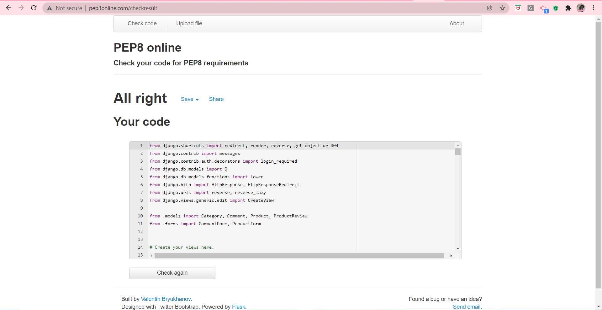

# TESTING

## Validator Testing

[PEP8 online validator](https://www.pep8online.com)

This tool was used to validate my .py files to ensure there are no syntax errors or improper code indentation. They passed the test as seen in the screenshots below:

* cart/apps.py:

* cart/contexts.py:

* cart/templatetags/cart_tools.py:

* cart/urls.py:

* cart/views.py:

* checkout/admin.py:

* checkout/apps.py:

* checkout/forms.py:

* checkout/models.py:

* checkout/signals.py:

* checkout/urls.py:

* checkout/views.py:

* checkout/webhook_handler.py:

* checkout/webhooks.py:

* home/apps.py:

* home/urls.py:

* home/views.py:

* products/admin.py:

* products/apps.py:

* products/forms.py:

* products/models.py:

* products/urls.py:

* products/views.py:

* products/widgets.py:

* profiles/apps.py:

* profiles/forms.py:

* profiles/models.py:

* profiles/urls.py:

* profiles/views.py:

* wigalleria/asgi.py:

* wigalleria/custom_storages.py:

* wigalleria/settings.py:

* wigalleria/urls.py:

* wigalleria/wsgi.py:

[w3html validator](https://validator.w3.org) 

This tool was used to validate all my html templates and I got just two warnings on the checkout page about type attribute not necessary on javascript resource while the rest of the pages are free of errors and warnings. See screenshots below:

* cart/templates/cart/cart.html Page:

* checkout/templates/checkout/checkout_success.html Page:

* checkout/templates/checkout/checkout.html Page:

* home/templates/home/index.html Page:

* products/templates/products/add_comment.html Page:

* products/templates/products/add_product.html Page:

* products/templates/products/delete_product.html Page:

* products/templates/products/edit_product.html

* products/templates/products/product_detail.html

* products/templates/products/products.html

* products/templates/products/user_wish_list.html

[w3CSS validator](http://jigsaw.w3.org/css-validator/)

This tool was used to validate my custom css code and it passed successfully. See screenshot below:

* Custom CSS (checkout/static/checkout/css/checkout.css):

* Custom CSS (profiles/static/profiles/css/profile.css):

* Custom CSS (static/css/base.css):

[JSHint validator](https://jshint.com/)

This tool was used to validate my javascript code and they passed successfully. See screenshots below:

---

### Manual Testing of wiGalleria app Functionalities 

* Testing User Stories from User Experience (UX) Section

First Time User Goals

i) As a First Time User, I want to be able to easily understand the main purpose of the site and the app to be intuitive so I can navigate through the site easily without any ambiguity. 

a)

First Time or Guest User Goals

i) As a First Time or Guest User, I want to be able to register/sign up for an account in order to have a personal account that will allow me view my profile. 

a)

ii) As a First Time or Guest User, I want to be able to receive confirmation email after registration/signing up for an account

a)

Registered User Goals

i) As a Registered User who is logged in, I want to be able to save my shipping details so that when I'm logged in, I can check out faster anytime I shop again.

a)

ii) As a Registered User who is logged in, I want to be able to have a personalised user profile when I'm logged in so that I can view my personalised order history, order confirmation and save my payment information. 

a)

iii) As a Registered User who is logged in, I want to be able to add general/specific comments relating to a product so that I can convey any general or specific issue I have with the ordering of the product to the seller

a)

iv) As a Registered User who is logged in, I want to be able to review a product so that I can give feedback to the seller on his product

a)

v) As a registered user who is logged in I want to be able to like/unlike a product so that I can spot it easily when I want to buy it later/again or mark it down if it wasn't as described by the seller after purchase.

a)

vi) As a Registered User who is logged in, I want to be able to log out of my account so that my account can be safe from unauthorised access.

a)

vii) As a Registered User, I want to be able to log in to my account so that I can access my personal account information.

a)

viii) As a Registered User, I want to be able to access information through their social media links to see their followings on social media to determine how trusted and known the app is.

a)

---

First Time, Registered or Guest User Goals

i) As a First Time, Registered or Guest User, I want to be able to easily see the image, name, price, rating & category of the product I want to buy in order to know that I'm buying the right product at the price I can afford.

a)

ii) As a First Time, Registered or Guest User, I want to be able to quickly identify deals, clearance items and special offers in order to take advantage of special savings on products I'd like to purchase.

a)

iii) As a First Time, Registered or Guest User, I want to be able to easily view the total of my purchase at any time so that I can avoid spending too much.

a)

iv) As a Registered, First time or Guest User, I want to be able to view all available products in order to select some for purchase.

a)

v) As a First time, Registered or Guest User, I want to be able to easily check out anonymously in order to purchase products without logging in or setting up an account.

a)

vi) As a First time, Registered or Guest User, I want to be able to easily delete product(s) in the cart in order to have the choice to remove it if not needed anymore.

a)

vii) As a First time, Registered or Guest User, I want to be able to update products in the cart in order to adjust it any time if I change my mind.

a)

viii) As a First time, Registered or Guest User, I want to be able to view products in the cart in order to know what I'm purchasing.

a)

ix) As a First time, Registered or Guest User, I want to be able to add product/products to the cart in order to purchase a single one or check out multiple items in one click.

a)

x) As a First time, Registered or Guest User, I want to be able to access information through their social media links to see their followings on social media to determine how trusted and known the app is. 

a)

xi) As a First time, Registered or Guest User, I want to be able to view a list of products so that I can select some to purchase.

a)

xii) As a First time, Registered or Guest User, I want to be able to receive an email confirmation after checking out so that I can keep the confirmation of what I've purchased for my records.

a)

xiii. As a First time, Registered or Guest User, I want to be able to view my order confirmation after checkout so that I can verify that I haven't made any mistakes while placing the order.

a)

xiv. As a First time, Registered or Guest User, I want to be able to easily enter my payment information so that I can check out quickly with no hassles.

a)

xv. As a First time, Registered or Guest User, I want to be able to update the quantity of individual item in my cart so that I can easily make changes to my purchase before checkout.

a) A user can update the quantity of products already selected in her shopping bag before checking out by selecting the right quantity using quantity selector box and click on the update link provided underneath.

xvi. As a First time, Registered or Guest User, I want to be able to easily select a product's quantity during purchase so that I can guard against accidentally selecting the wrong quantity.

a) Each product detail page has its own quantity selector box to avoid selecting the wrong quantity

xvii. As a First time, Registered or Guest User, I want to be able to view a specific category of products so that I can quickly find products I'm interested in without having to search through all products.

a) A user can use the search input box provided at the main nav section of the page to display the products with the category she's interested in and filter out other categories.

xviii. As a First time, Registered or Guest User, I want to be able to view individual product detail so that I can see detailed information about its description, like, review or leave a comment.

---

Admin User Goals

i. As an Admin User, I want to be able to log into my account in order to have the authorised access to manage products in the database.

a)

ii. As an Admin User, I want to be able to log out of my account in order to protect it from unauthorised access.

a)

iii. As an Admin User, I want to be able to manage products within the store i.e create/add, read/view, update/edit & delete products into/from the database so that users of the website can enjoy a good user experience when interacting with the site.

a) An admin user can add products into the database. After logging in, navigate to 'My Accounts' in the nav bar area and then select 'Store Management' which will take her to the 'add products' page as seen in the screenshot below: 

b) An admin user can view products in the database in 2 ways i.e either through the front-end or back-end using the django admin. For the front-end access, navigate to 'All Products' in the nav bar area after logging in and then select 'All Products' which will take her to the 'all products' page where she can view all products in the database as seen in the screenshot below:

c)

d)

                SHOPPING LIST PLANNER USER GOALS TO USE AS EXAMPLE, DELETE LATER
First Time User Goals

i. As a First Time Visitor, I want to easily understand the main purpose of the site and learn more about the app

a) When a visitor clicks on the app's url and since he's not registered, he lands on the welcome page where extensive details about the app is given so he can read through to get an understanding of the main purpose of the site and learn more about the app. See screenshot below:

---

# Issues Encountered and Resolved

* There were some issues experienced with the products page after deployment to Heroku. 12 of the products were missing but visible on the development side. I went to the media folder of the aws bucket created for wiGalleria to check if the products names there corresponds to the ones in the media folder on gitpod workspace and discovered that I gave the wrong extension to some i.e .jpg instead of .png, some had name mismatch and as soon as I corrected those, most of the images showed up leaving 2 products missing. I then went to the database through Django admin and re-entered the names of those 2 products checking that they match the ones in aws bucket, then add, commit & push them to GitHub, refreshed the Heroku deployed site and all products images were displayed correctly. See screenshots below:

* The stripe webhook failed when I sent a test event to a webhook endpoint. It gave an error message of "Test webhook error: 502" and after thorough checking, two causes were discovered which are:
* The empty variables placeholders I left in the env.py file were preventing Stripe from seeing the stripe keys in there. They were left there in case more environment variables need to be added to my env.py file but I didn't realise quickly enough that this was the root cause that prevents Stripe from seeing the stripe keys in env.py files. 
* Secondly, I placed the env.py in the wrong location i.e in the wigalleria app instead of the root directory. I fixed these issues by commenting the environment variables placeholders out and moving the env.py file to the root directory, then ran the webhook test again & received a successful message this time, it worked. See screenshots below:

* When an admin user wants to carry out a delete product opertion, there is a confirmation message displayed to him to confirm if he actually wants to delete that product or cancel the delete and return to home. It should specifically mention the name of that product to be deleted so the user can make a choice if to go ahead with the deletion or cancel it but when I tested this feature on completion, it displayed the message quite alright but didn't render the product's name but left it blank. It was discovered that the issue with this was that in my delete_product function view views.py, I didn't render the product got by the get_object() function in a context so the context had no name of product to render so it displayed an empty quotes (i.e "") but onec I added the product variable name into the context, the issue was solved. See screenshots of before and after below:

* Also, I had an issue with the products delete view for an admin user. I included a message that allows an admin user to confirm deletion or cancel before the actual deletion takes place. This was put in place to avoid deletion by mistake but when it was run in the browser, it threw an error with the message "delete view template does not exist". This was due to the fact that I omitted "products/" that should precede the delete_product.html template name in my path name when I was rendering it. According to my file path, the delete_product.html template resides inside the products folder so that should be specifed as "products ---> templates ---> products" directory but as soon as that was corrected, the template rendered appropriately. See screenshot of error message and its solution below:

* An issue erupted during the Heroku deployment. Since the rule is that after connecting to Postgres, we must run migrations again using the commands "showmigrations" & "migrate" afterwards. I ran the showmigrations successfully but when I put in the terminal the "migrate" command, it threw an error that says "AssertionError: database connection isn't set to UTC". I then googled for this issue to find the cause & possible solutions to this sort of error and found a very helpful resource on stackoverflow which explained that this issue was caused as a result of a recent update to version 2.9 of psycopg2 as explained in this GitHub issue: 
[GitHub Link to resolve database UTC Issue](https://github.com/psycopg/psycopg2/issues/1293#issuecomment-862835147)

* The solution given to this problem on stackoverflow is to downgrade psycopg2 (or psycopg2-binary if you are using the stand-alone package) below 2.9 (e.g. psycopg2>=2.8,<2.9) in your requirements file e.g downgrade to 2.8.6 using: pip3 install psycopg2==2.8.6
I did that and the issue was resolved. 
The link to the solution on stackoverflow is below:
[stackoverflow Link to resolve database UTC Issue](https://stackoverflow.com/questions/68024060/assertionerror-database-connection-isnt-set-to-utc)

* After creating the footer code in my base.html template and viewed it in the browser, I found out that it didn't display at the right location. It was joined together with the navbar section at the top of each page instead of the bottom. I tried playing around with the chunk of the footer code by moving it from one section to the other to see if that would resolve the issue but it didn't so I had to contact Code Institute tutor support for help. It was there that the tutor pointed my attention to where I placed the footer, immediately after the closing head tag and ignoring the block content code there. In the tutor's words: 
"The main content and the header is actually below the footer, please look at line starting 181 - 185 in base.html, I believe that should be moved to line 147". I followed his instruction, viewed my code in the browser and found out that the footer has rightly moved to the bottom across all pages. See screenshots below:

* Another issue was encountered during the implementation of Stripe payment for my project. I created the payment intent in my checkout views.py but when I opened it in the browser to check it out, it broke my checkout page giving an error that says "Authenticationerror at checkout. You did not provide an API key. You need to provide your API key in the Authorization header, using Bearer auth (e.g. 'Authorization: Bearer YOUR_SECRET_KEY')". I tried to solve this issue but was unable to so I contacted tutor support and after much troubleshooting, she noticed that 'env.py' file is not being read correctly in settings.py. On a closer look by the tutor and her colleague, it was discovered that the error was caused as a result of the empty variables set with no name and values in env.py file. Commenting out all these empty variables in env.py file solved the issue and the code ran successfully.
See screenshots below:

* An issue was encountered on the profile page. Instead of the footer being displayed at the bottom of the page, it showed up at the order history section to the right of the default delivery information while the order history was pushed underneath it. Initially, I used the dev tools to inspect to see if I could resolve it but couldn't so I went to tutor support but no one was available until tomorrow so I went back to take a proper look again and discovered that there were some unclosed tags on the page. One table and div tags were unclosed so I closed them, refreshed the page in the browser and everything took the right shape again. See screenshots below:

