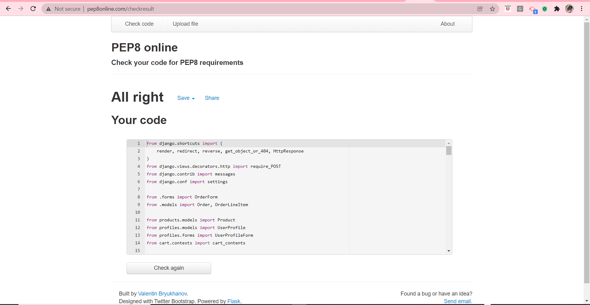
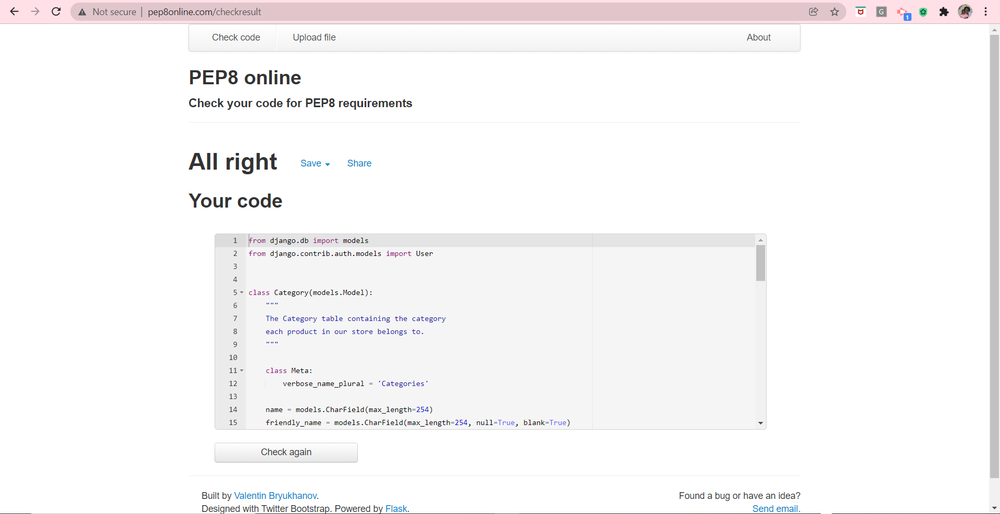
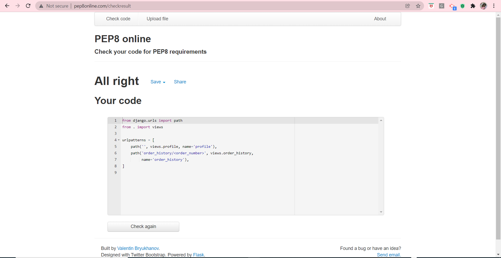
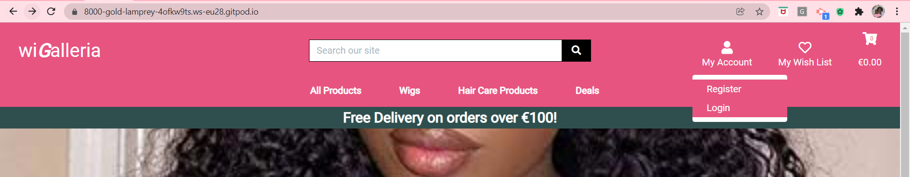
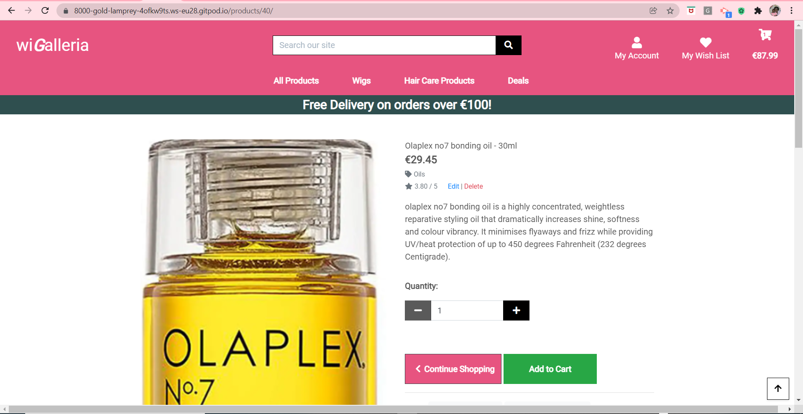
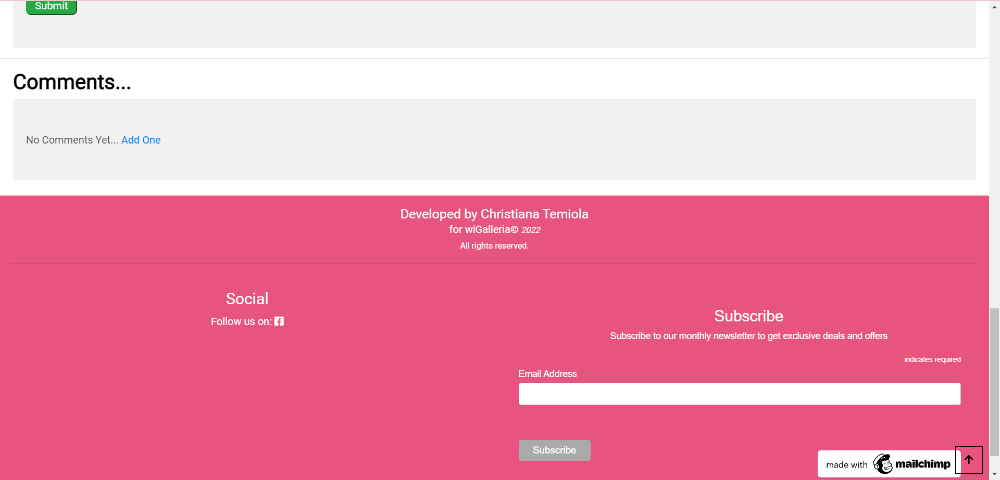
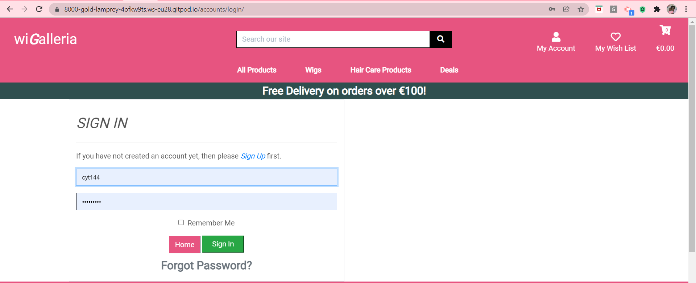
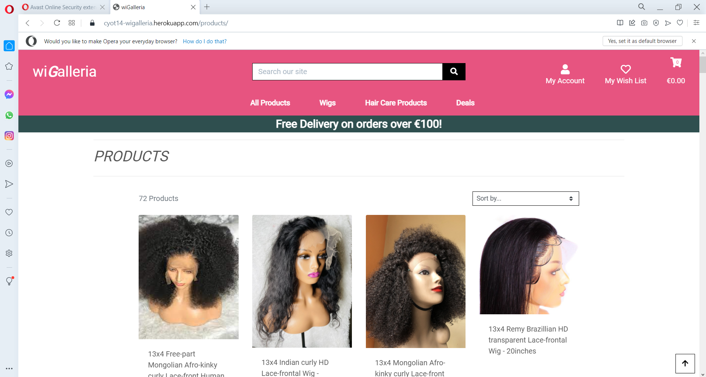

# TESTING

## Validator Testing

[PEP8 online validator](https://www.pep8online.com)

This tool was used to validate my .py files to ensure there are no syntax errors or improper code indentation. They passed the test as seen in the screenshots below:

* cart/apps.py:

* cart/contexts.py:

* cart/templatetags/cart_tools.py:

* cart/urls.py:

* cart/views.py:

* checkout/admin.py:

* checkout/apps.py:

* checkout/forms.py:

* checkout/models.py:

* checkout/signals.py:

* checkout/urls.py:

* checkout/views.py:

* checkout/webhook_handler.py:

* checkout/webhooks.py:

* home/apps.py:

* home/urls.py:

* home/views.py:

* products/admin.py:

* products/apps.py:

* products/forms.py:

* products/models.py:

* products/urls.py:

* products/views.py:

* products/widgets.py:

* profiles/apps.py:

* profiles/forms.py:

* profiles/models.py:

* profiles/urls.py:

* profiles/views.py:

* wigalleria/asgi.py:

* wigalleria/custom_storages.py:

* wigalleria/settings.py:

* wigalleria/urls.py:

* wigalleria/wsgi.py:

[w3html validator](https://validator.w3.org) 

This tool was used to validate all my html templates and I got just two warnings on the checkout page about type attribute not necessary on javascript resource while the rest of the pages are free of errors and warnings. See screenshots below:

* cart/templates/cart/cart.html Page:

* checkout/templates/checkout/checkout_success.html Page:

* checkout/templates/checkout/checkout.html Page:

* home/templates/home/index.html Page:

* products/templates/products/add_comment.html Page:

* products/templates/products/add_product.html Page:

* products/templates/products/delete_product.html Page:

* products/templates/products/edit_product.html

* products/templates/products/product_detail.html

* products/templates/products/products.html

* products/templates/products/user_wish_list.html

[w3CSS validator](http://jigsaw.w3.org/css-validator/)

This tool was used to validate my custom css code and it passed successfully. See screenshot below:

* Custom CSS (checkout/static/checkout/css/checkout.css):

* Custom CSS (profiles/static/profiles/css/profile.css):

* Custom CSS (static/css/base.css):

[JSHint validator](https://jshint.com/)

This tool was used to validate my javascript code and they passed successfully. See screenshots below:

---

### Manual Testing of wiGalleria app Functionalities 

* Testing User Stories from User Experience (UX) Section

First Time User Goals

i) As a First Time User, I want to be able to easily understand the main purpose of the site and the app to be intuitive so I can navigate through the site easily without any ambiguity. 

a) The purpose of the site is clearly evident from the first time a user lands on the home page. The name of the app 'wiGalleria' and the 'shop now' button speaks volume about what the site is all about. The flow of each element and its position on each page from the shopping cart and navigation links at the top to the footer at the bottom of the page follows the consistency and uniformity that is obtained on all e-commerce websites which makes it easy for a first time user to get a hang of it quickly. See screenshot of the home page below:

First Time or Guest User Goals

i) As a First Time or Guest User, I want to be able to register/sign up for an account in order to have a personal account that will allow me view my profile. 

a) On the home page, click on 'My Account' and from the drop-down, click on the 'Register' link and the sign-up page will be displayed to the user. See screenshots below:

ii) As a First Time or Guest User, I want to be able to receive confirmation email after registration/signing up for an account.

a) Once the user has successfully signed up for an account, a message is displayed to her to confirm her email address and after that another message is displayed to inform her that an email has been sent to her address in order to finalise the sign up process so go to your email and click on that link provided and all is then set. See screenshots below:

Registered User Goals

i) As a Registered User who is logged in, I want to be able to save my shipping details so that when I'm logged in, I can check out faster anytime I shop again.

a) On the checkout page, after the user fills her delivery details, there is a checkbox provided where a user has the option to save her delivery/shipping details to her profile so that when next she shops again, her shipping details will be prepopulated into the right fields. See screenshots below:

ii) As a Registered User who is logged in, I want to be able to have a personalised user profile when I'm logged in so that I can view my personalised order history, order confirmation and payment information. 

a) When a user is logged in, she can view her personalised user profile by clicking on 'My Account' and from the drop-down, click 'Profile', then her profile which contains her order history, order confirmation and payment information will be displayed as shown in the screenshots below:

iii) As a Registered User who is logged in, I want to be able to add general/specific comments relating to a product so that I can convey any general or specific issue I have with the ordering of the product to the seller.

a) From the home page, the 'shop now' button takes the user to the products page or from any other page, click on 'All Products' displayed at the top of the page and from the drop-down, click on 'All Products' again. Then click on a product's image to open that product in a new tab, then scroll down and you will see the comment section where the user can click on the 'Add Comment' link to add comment. See screenshot below: 

iv) As a Registered User who is logged in, I want to be able to review a product so that I can give feedback to the seller on his product.

a) From the home page, the 'shop now' button takes the user to the products page or from any other page, click on 'All Products' displayed at the top of the page and from the drop-down, click on 'All Products' again. Click on a product's image to open that product in a new tab, then scroll down and you will see the review section where the user can select the number of stars she wishes to give a product and/or leave review in the text area provided. See screenshot below: 

v) As a registered user who is logged in I want to be able to like/unlike a product so that I can spot it easily when I want to buy it later/again or mark it down if it wasn't as described by the seller after purchase.

a) From the home page, the 'shop now' button takes the user to the products page or from any other page, click on 'All Products' displayed at the top of the page and from the drop-down, click on 'All Products' again. Click on a product's image to open that product in a new tab, then in the product description area, click on the heart button and toggle it on or off to like or unlike a product.  See screenshot below: 

vi) As a Registered User who is logged in, I want to be able to log out of my account so that my account can be safe from unauthorised access.

a) From any page that the user is, click on 'My Account' and then on the 'Logout' link, it displays a message to the user to confirm if she wants to sign out and if the user clicks on the 'sign out' button, she is logged out of her account and a pop-up message is displayed to reflect that as shown in the screenshots below:

vii) As a Registered User who is logged in, I want to be able to add product to my wishlist so that I can easily find them for purchase later.

a) On the product detail page, a user can add products to the wishlist by clicking on the 'Add to Wish List' button located underneath the 'Continue Shopping' button. See screenshot below:

viii) As a Registered User who is logged in, I want to be able to view product(s) in my wishlist so that I can be reminded of the product I want to buy later.

a) A user can view products in her wish list in 2 ways, either by clicking on the 'View Wish List' button located underneath the 'Add to Cart' button or by clicking on the heart icon located at the top of the page in the navigation bar area. See screenshots below: 

ix) As a Registered User who is logged in, I want to be able to remove product(s) in my wishlist so that I can free up space to add more products.

a) From any page that the user is, click on the heart icon located at the top of the page in the navigation bar area which will take the user to the wishlist page. The wishlist contains all the products the user saved so to remove any product, click on the 'Remove' button located beside the product you want to remove and it's done. See screenshots below:

x) As a Registered User, I want to be able to log in to my account so that I can access my personal account information.

a) From any page that the user is, click on 'My Account' located at the top of the page and then on the 'Login' link, it displays the 'sign in' page where she's prompted to fill her details into their appropriate boxes and if they match what's on record, she is successfully logged into her account and a pop-up message is displayed to reflect that. See screenshots below:

xi) As a Registered User, I want to be able to access information through their social media links to see their followings on social media to determine how trusted and known the app is.

a) On most websites, the footer houses the social media icons and links and ours is not an exception so from any page that the user is, scroll down to the bottom of the page and the link to our facebook page is there for the user to use. See screenshot below:

---

First Time, Registered or Guest User Goals

i) As a First Time, Registered or Guest User, I want to be able to easily see the image, name, price, category, rating & description of the product I want to buy in order to know that I'm buying the right product at the price I can afford.

a) On the product detail page, the user can see all these information displayed to her as seen in the screenshot below:

ii) As a First Time, Registered or Guest User, I want to be able to quickly identify deals, clearance items and special offers in order to take advantage of special savings on products I'd like to purchase.

a) This can be accessed from any page that the user is currently on by clicking on 'Deals' displayed at the top of the page and then select any of the links i.e reductions, clearance or deals based on what she wants. See screenshot below:

iii) As a First Time, Registered or Guest User, I want to be able to easily view the total price of my purchase at any time so that I can avoid spending too much.

a) This can be easily seen from any page that the user is within the site. It's displayed underneath the shopping cart icon at the top right corner of the page. See screenshot below:

iv) As a Registered, First time or Guest User, I want to be able to view all available products in order to select some for purchase.

a) This can be accessed from any page that the user is within the site. In the navigation area at the top of the page, click on 'All Products' and then on 'All Products' again and it will display all the products available in the store as seen in the screenshots below:

v) As a First time, Registered or Guest User, I want to be able to easily check out anonymously in order to purchase products without logging in or setting up an account.

a) From the home page, the user can select products, put in her cart, checkout, make payment and receive confirmation of successful checkout as an anonymous user i.e without logging in. One of the screenshots show that under the 'My Account' navigation header, the 'Register' and 'Login' links are displayed while the 'Logout' link is not in view which means that the user is not logged in as seen in the screenshots below: 

vi) As a First time, Registered or Guest User, I want to be able to easily delete product(s) in the cart in order to have the choice to remove it if not needed anymore.

a) When a user adds products into the shopping cart and navigates to the cart by clicking on the 'Continue to Secure Checkout' button, she can remove any one using the remove link provided underneath the 'Qty' button and that product will be removed from the cart. See screenshots below:

vii) As a First time, Registered or Guest User, I want to be able to update products in the cart in order to adjust it any time if I change my mind.

a) When a user adds products into the shopping cart and navigates to the cart to view it by clicking on the 'Continue to Secure Checkout' button, she can update the contents of the shopping cart in many ways e.g clicking on the 'Continue Shopping' button to add more products into the cart, clicking on the '+' or '-' quantity button first before clicking on the 'Update' link under it to increase or decrease the quantity of products already in the cart. See screenshots below:

viii) As a First time, Registered or Guest User, I want to be able to view products in the cart in order to know what I'm purchasing.

a) When a user adds products into the shopping cart either from 'products' or 'product-detail' page and clicks on the 'Continue to Secure Checkout' button, it takes her to the shopping cart where she can view the products (i.e contents) in her shopping cart as seen in the screenshots below:

ix) As a First time, Registered or Guest User, I want to be able to add product/products to the cart in order to purchase a single one or check out multiple items in one click.

a) From either the 'products' or 'product-detail' page, a user can add product(s) into the shopping cart as seen in the screenshots below:

x) As a First time, Registered or Guest User, I want to be able to access information through their social media links to see their followings on social media to determine how trusted and known the app is. 

a)  On most websites, the footer houses the social media icons and links and ours is not an exception so from any page that the user is, scroll down to the bottom of the page and the link to the facebook page is there for the user to use. See screenshot below:

xi) As a First time, Registered or Guest User, I want to be able to receive an email confirmation after checking out so that I can keep the confirmation of what I've purchased for my records.

a) When a user checks out successfully after purchase, a confirmation email is sent to her as a proof of order. See screenshot below:

xii. As a First time, Registered or Guest User, I want to be able to view my order confirmation after checkout so that I can verify that I haven't made any mistakes while placing the order.

a) After a successful checkout, a user receives an order confirmation showing the order number and details of her order. See screenshots below:

xiv. As a First time, Registered or Guest User, I want to be able to easily enter my payment information so that I can check out quickly with no hassles.

a) The user can pay for her products quickly on the checkout page where a form is displayed for the user to fill both her credit card and personal details. The payment is collected using Stripe in a safe and secure manner with all the security checks in place. See screenshots below:

xv. As a First time, Registered or Guest User, I want to be able to update the quantity of individual item in my cart so that I can easily make changes to my purchase before checkout.

a) A user can update the quantity of products already selected in her shopping bag before checking out by selecting the right quantity using quantity selector box and click on the update link provided underneath. See screenshots below:

xvi. As a First time, Registered or Guest User, I want to be able to easily select a product's quantity during purchase so that I can guard against accidentally selecting the wrong quantity.

a) Each product detail page has its own quantity selector box to avoid selecting the wrong quantity as seen in the screenshot below:

xvii. As a First time, Registered or Guest User, I want to be able to view a specific category of products so that I can quickly find products I'm interested in without having to search through all products.

a) A user can use the search input box provided at the main nav section of the page to display the products with the category she's interested in and filter out other categories.
See screenshot below:

xviii. As a First time, Registered or Guest User, I want to be able to view individual product detail so that I can see detailed information about its description, like, review or leave a comment.

a) The user can access all these features by navigating to the 'product_detail' page. From the navigation bar, click on 'All Products' and then 'All Products' again. This will take you to the page that displays all the products in the store. Click on a product's image to take you to the product-detail page and you will find all the information needed as seen in the screenshot below:

---

Admin User Goals

i. As an Admin User, I want to be able to log into my account in order to have the authorised access to manage products in the database.

a) From the home page, navigate to 'My Account' and under it, click on 'Login' and the Sign in page will be displayed. Enter your super user details and if it matches what's on record, it will log you in successfully as seen in the screenshots below:

ii. As an Admin User, I want to be able to log out of my account in order to protect it from unauthorised access.

a) From any page within the site, navigate to My Account and under it, click on Logout and the pop up message will be displayed to confirm if you want to sign out and if the sign out button is clicked, the user is successfully logged out with a message displayed to reflect this as seen in the screenshots below:

iii. As an Admin User, I want to be able to manage products within the store i.e add, view, edit & delete products into or from the database so that users of the website can enjoy a good user experience when interacting with the site.

a) An admin user can add products into the database. After logging in, navigate to My Accounts in the nav bar area and then select Store Management, this will take you to the add products page where new products can be added to the database at the back end as seen in the screenshot below: 

b) An admin user can view products in the database in 2 ways i.e either through the front-end with the products page or back end using the django admin. For the front-end access, navigate to All Products header in the nav bar area after logging in and then select All Products link and the products page will be displayed where you can view all products in the database. For the back-end view, on the home page, append forward slash admin to the URL and navigate to Django admin login page. Provide your login details as seen in the screenshot below:

* Front end Products view:

* Back end Products view:

c) An admin user can edit products in the database in 2 ways i.e either through the products or product detail page. From the home page or any other page, navigate to All Products in the nav bar area and click on All Products link again. It will display the products page, click on the edit button displayed beside the product you want to edit and it will display the edit page for you to make the ammendment and save it back into the database. The 2nd way to edit is that while on the products page, click on the image of the product you want to edit and it will open in new tab, click on the edit button displayed beside the product and it will display the edit page for you to make the ammendment after which you can save it back to the database. See screenshots below:

d) An admin user can delete products in the database in 2 ways i.e either through the products or product detail page. From the home page or any other page, navigate to 'All Products in the nav bar area and click on All Products link again. It will display the all products page, click on the delete button displayed beside the product you want to remove and it will be deleted immediately and a pop up message displayed to confirm that the product has been deleted from the database.
The 2nd way to delete a product is this: while on the products page, click on the image of the product you want to delete and it will open in new tab, click on the delete button displayed beside the product and it will be removed immediately from the database. See screenshot below:

---

# Browser Compatibility Testing

* I carried out compatibility test across three different browsers below and the site rendered correctly and were responsive across these browsers. See screenshots below:

i. Google Chrome

ii. Microsoft Edge

iii. Opera

